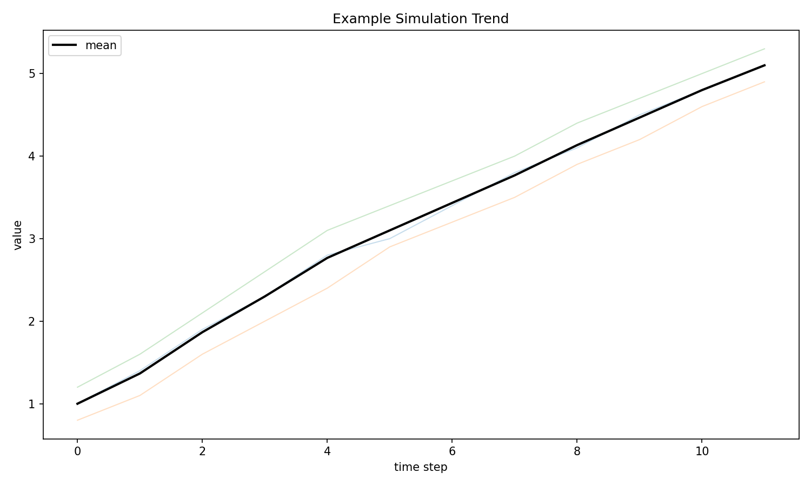
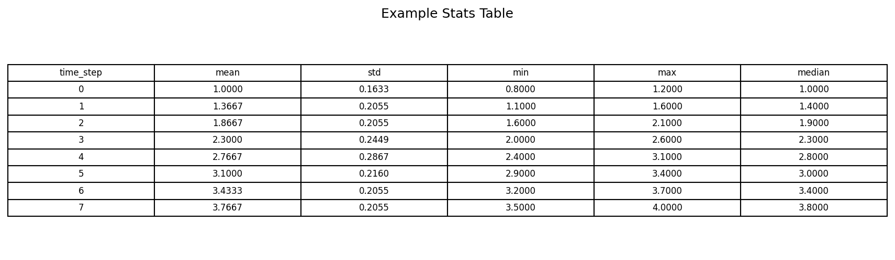

# distill-abm

Production Python package for ABM-to-LLM distillation, extracted from legacy notebooks with regression-backed parity.

## Repository layout

- `src/distill_abm/` - main production codebase
- `tests/` - unit, integration, e2e, and notebook-regression tests
- `configs/` - YAML configs for models, prompts, ABMs, evaluation, logging
- `configs/notebook_prompt_reference.yaml` - canonical notebook prompt/reference capture with provenance
- `configs/notebook_experiment_settings.yaml` - preserved notebook experiment defaults (LLM + DoE)
- `archive/legacy_repo/` - full legacy repository snapshot (notebooks + assets)
- `docs/` - architecture and parity documentation

## Codebase organization

```text
distill-abm/
├── configs/
│   ├── models.yaml
│   ├── prompts.yaml
│   ├── evaluation.yaml
│   ├── notebook_prompt_reference.yaml
│   ├── notebook_experiment_settings.yaml
│   └── notebook_prompt_assets/
├── src/distill_abm/
│   ├── configs/           # typed config loaders and models
│   ├── eval/              # scoring and statistical workflows
│   ├── ingest/            # NetLogo and CSV preprocessing
│   ├── legacy/            # loader, compatibility, migration safety
│   ├── llm/               # provider adapters and model selection
│   ├── pipeline/          # end-to-end CLI orchestration
│   ├── summarize/         # text cleanup and summarization options
│   └── viz/               # plot and stats-table generation
├── docs/                  # parity, coverage, and manifest evidence
├── archive/legacy_repo/   # retained legacy notebooks and raw inputs
└── tests/                 # unit, integration, regression, e2e
```

The top-level runtime entrypoint is `src/distill_abm/cli.py`. The parity surface is in `src/distill_abm/legacy/compat.py`, with dispatch governed by `src/distill_abm/legacy/notebook_loader.py`.

## Quickstart

```bash
uv sync --extra dev
uv run ruff check .
uv run black --check .
uv run mypy src tests
uv run pytest -q
```

## CLI

Run distillation pipeline:

```bash
uv run distill-abm run \
  --csv-path path/to/reduced.csv \
  --parameters-path path/to/params.txt \
  --documentation-path path/to/docs.txt \
  --abm milk_consumption \
  --provider openai \
  --model gpt-4o
```

Notebook-style plot description can be explicitly overridden:

```bash
uv run distill-abm run ... --plot-description "The attachment is the plot representing ..."
```

Run evidence ablations for reviewer comparisons:

```bash
# plot-only (image)
uv run distill-abm run ... --evidence-mode plot

# stats-only (markdown table in prompt)
uv run distill-abm run ... --evidence-mode stats-markdown

# stats-only (table image for multimodal input)
uv run distill-abm run ... --evidence-mode stats-image

# plot + stats (plot image + markdown stats table in prompt)
uv run distill-abm run ... --evidence-mode "plot+stats"
```

Run no-summarization baseline (skip BART/BERT summarization and keep direct LLM report text):

```bash
uv run distill-abm run \
  --csv-path path/to/reduced.csv \
  --parameters-path path/to/params.txt \
  --documentation-path path/to/docs.txt \
  --evidence-mode "plot+stats" \
  --skip-summarization
```

Run notebook-style combination sweeps from code (role/example/insights variants across multiple images):

```python
from pathlib import Path

from distill_abm.pipeline.run import PipelineInputs, run_pipeline_sweep
from distill_abm.configs.loader import load_prompts_config
from distill_abm.llm.factory import create_adapter

prompts = load_prompts_config(Path("configs/prompts.yaml"))
adapter = create_adapter("openai", model="gpt-4o")

output_csv = run_pipeline_sweep(
    inputs=PipelineInputs(
        csv_path=Path("results/reduced.csv"),
        parameters_path=Path("params.txt"),
        documentation_path=Path("documentation.txt"),
        output_dir=Path("results/sweep"),
        model="gpt-4o",
        metric_pattern="mean-incum",
        metric_description="weekly milk trend",
    ),
    prompts=prompts,
    adapter=adapter,
    image_paths=[Path("results/plots/p1.png"), Path("results/plots/p2.png")],
    plot_descriptions=["Plot 1 description", "Plot 2 description"],
)
print(output_csv)
```

For Claude and Deepseek legacy-combination parity, `run_pipeline_sweep` also supports:

- `csv_column_style="plot"` to emit notebook headers (`Plot N Prompt`, `Plot N Analysis`)
- `resume_existing=True` to update/continue an existing combinations CSV
- separate adapters/models for context and trend phases (`context_adapter` / `trend_adapter`, `context_model` / `trend_model`)

Run qualitative evaluation (Coverage/Faithfulness scored by LLM):

```bash
# coverage from summary + source text
uv run distill-abm evaluate-qualitative \
  --summary-text "Generated ABM summary..." \
  --source-text "ABM context and evidence..." \
  --metric coverage \
  --provider openai \
  --model gpt-4o

# faithfulness with optional source image for multimodal models
uv run distill-abm evaluate-qualitative \
  --summary-text "Generated ABM summary..." \
  --source-text "ABM context and evidence..." \
  --metric faithfulness \
  --source-image-path results/pipeline/mean-incum.png \
  --provider openai \
  --model gpt-4o
```

Expected output JSON:

```json
{
  "score": 4,
  "reasoning": "Coverage score: 4. Most key dynamics and turning points are captured.",
  "model": "gpt-4o"
}
```

### Evidence Artifacts and Examples

- Runtime artifacts:
  - Plot artifact (`plot` mode): `results/pipeline/mean-incum.png`
  - Stats image artifact (`stats-image` mode): `results/pipeline/mean-incum_stats.png`
  - Report artifact: `results/pipeline/report.csv`

Embedded examples:

Plot example (`plot` mode):



Stats table image example (`stats-image` mode):



Stats markdown table example (used in `stats-markdown` and `plot+stats` modes):

| time_step | mean | std | min | max | median |
| --- | --- | --- | --- | --- | --- |
| 0 | 1.5000 | 0.5000 | 1.0000 | 2.0000 | 1.5000 |
| 1 | 2.5000 | 0.5000 | 2.0000 | 3.0000 | 2.5000 |
| 2 | 3.5000 | 0.5000 | 3.0000 | 4.0000 | 3.5000 |

The stats table always includes, per time step: `mean`, `std`, `min`, `max`, and `median`.

Run DoE ANOVA analysis:

```bash
uv run distill-abm analyze-doe \
  --input-csv path/to/FinalResultsYesNo.csv \
  --output-csv results/doe/anova_factorial_contributions.csv
```

## Docker

```bash
docker build -t distill-abm .
docker run --rm distill-abm
```

## CI

- GitHub Actions workflow at `.github/workflows/ci.yml`
- Runs on push and pull request:
  - `ruff check .`
  - `black --check .`
  - `mypy src tests`
  - `pytest`

## Parity policy

- Legacy notebooks are preserved under `archive/legacy_repo/`.
- `docs/archive_full_manifest.json` provides a file-by-file migration classification and action trail for all archive assets.
- `docs/archive_full_manifest.json` marks loader-dependent notebooks as `runtime_required`; current status is `0` runtime-required notebooks/functions, with notebook-backed behavior covered by fallback/parity tests.
- `docs/runtime_notebook_dependencies.json` maps each runtime-required notebook to the exact required function names currently sourced from it.
- Legacy CSV outputs and legacy plot/image artifacts are explicitly retained (not discarded) for reproducibility and reference.
- Notebook prompt sources are preserved in `configs/notebook_prompt_reference.yaml`, with runtime prompts in `configs/prompts.yaml` regression-locked to it.
- `configs/notebook_experiment_settings.yaml` now also preserves defaults from Fauna, Grazing, and Milk Consumption "From NetLogo to CSV" workflows (reporters, run loop settings, and parameter dictionaries).
- Regenerate parity/audit artifacts with `python scripts/refresh_parity_artifacts.py`.
- Notebooks removed from runtime usage now include:
  - `archive/legacy_repo/Code/Models/Fauna/3. (GPT) With combinations-Copy1 copy.ipynb`
  - `archive/legacy_repo/Code/Models/Grazing/3. With combinations-Copy1.ipynb`
  - `archive/legacy_repo/Code/Models/Milk Consumption/3. (GPT) With combinations.ipynb`
- Notebook-discard sequence is now: remove deprecated files, run `python scripts/refresh_parity_artifacts.py`, then run full gates.
- Deepseek-style dual-model sweep behavior (text context model + multimodal trend model) is supported directly in `run_pipeline_sweep`.
- `distill_abm.legacy.notebook_loader` builds a callable registry from notebooks and prefers sources in this order:
  - non-`archives` notebooks
  - non-checkpoint notebooks
  - non-`copy` notebook filenames
- Pipeline prompt assembly mirrors notebook structure:
  - context prompt: optional `style_features.role` + context template
  - trend prompt: optional `style_features.role`, trend template, optional `style_features.example`, optional `style_features.insights`, then plot description
- `run_pipeline` uses the pipeline default plot prompt unless `--plot-description` is explicitly provided.
- `distill_abm.legacy.compat` dispatches notebook-first for selected deterministic helpers and falls back to refactored package implementations when notebook loading/calls fail.
- `tests/regression/test_notebook_equivalence.py` validates behavior parity for migrated core utilities.
- `tests/regression/test_notebook_function_coverage.py` ensures every notebook function name is accounted for in the new codebase (`distill_abm.legacy.compat`) or explicitly exempted.

## Known limits

- Notebook execution is intentionally restricted to safe AST node types in the loader; some notebook side-effects are not replayed.
- Fallback behavior for complex legacy DoE CSV writers (`return_csv`, `return_csv_2`) aims for robustness but may differ in formatting if notebook execution is unavailable.
- Default LLM request temperature is set to `0.5` for notebook-aligned generation behavior.

See `docs/PARITY.md` for details.
