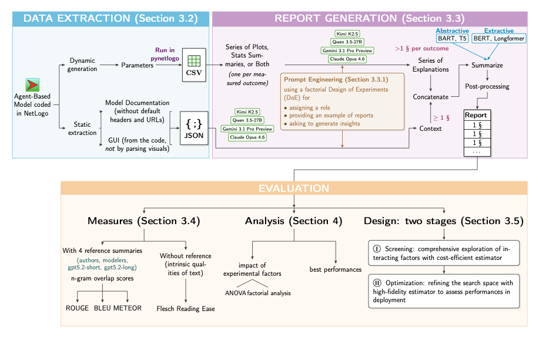

# distill-abm



*PDF source: [docs/assets/overview.pdf](docs/assets/overview.pdf)*

`distill-abm` is a reproducible research pipeline for converting agent-based model artifacts into evidence-backed LLM summaries, evaluations, and publication-ready reports.

`distill-abm` is the publication-facing repository for the ABM-to-LLM distillation pipeline used in the accompanying paper. The repository contains code, configs, tests, and minimal documentation. Published run outputs live in the [Hugging Face results bucket](https://huggingface.co/buckets/NoeFlandre/distill-abms-results), not in Git.

## Scope

The main pipeline has six stages:

1. ingest ABM parameters and documentation
2. generate simulation plots and statistical evidence
3. generate trend narratives from the evidence
4. optionally summarize those narratives
5. score outputs against reference texts
6. produce quantitative summary tables

Paper-facing benchmark runs are restricted to:

**Screening Stage** (fast, low-cost exploration):

1. `moonshotai/kimi-k2.5`
2. `qwen/qwen3.5-27b`

**Optimization Stage** (high-quality final runs):

3. `google/gemini-3.1-pro-preview`
4. `anthropic/claude-opus-4.6`

All other configured models are for debugging and development purposes only.

Supported summarizers are `bart`, `bert`, `t5`, and `longformer_ext`.

## Canonical Setup

The supported setup path is local `uv` on Python 3.11.

```bash
uv sync --frozen --extra dev
```

Assumptions:

- tested on macOS and Linux with Python 3.11
- NetLogo workflows require a local NetLogo installation
- API-backed workflows require provider credentials such as `OPENROUTER_API_KEY`

Runtime notes:

- `uv run pytest` currently completes in about one minute in this workspace
- NetLogo and API-backed runs are slower and depend on local hardware, provider latency, and model choice
- provider defaults and model aliases are documented in [docs/CONFIG_REFERENCE.md](docs/CONFIG_REFERENCE.md)

## Canonical Commands

Validate the local workspace without calling any benchmark LLM:

```bash
uv run distill-abm validate-workspace --json
```

Fetch published results from the Hugging Face bucket:

```bash
hf sync hf://buckets/NoeFlandre/distill-abms-results ./results
```

Sync a complete local `results/` tree back to the bucket:

```bash
uv run distill-abm sync-results-bucket
```

Run the main pipeline on one input bundle:

```bash
uv run distill-abm run \
  --csv-path data/samples/sim.csv \
  --parameters-path data/samples/params.txt \
  --documentation-path data/samples/docs.txt \
  --model-id kimi_k2_5 \
  --evidence-mode plot+table \
  --text-source-mode summary_only \
  --summarizer bart --summarizer bert --summarizer t5 --summarizer longformer_ext
```

Run the standard fixed-factor optimization smoke chain:

```bash
uv run distill-abm smoke-optimization-gemini-chain \
  --netlogo-home /path/to/NetLogo
```

## Results And Reproduction

The publication contract is:

1. set up the repository with `uv`
2. fetch the frozen results bucket into `./results`
3. inspect `results/quantitative_master_overview/`
4. rerun selected workflows only if you need to regenerate local artifacts

Results store:

- bucket URI: `hf://buckets/NoeFlandre/distill-abms-results`
- bucket web UI: `https://huggingface.co/buckets/NoeFlandre/distill-abms-results`

## Repository Layout

```text
src/distill_abm/        package source
configs/                runtime, model, prompt, and ABM configs
data/abms/              benchmark ABM assets and local fallback artifacts
data/summaries/         reference texts used for scoring
docs/                   focused reader-facing technical documentation
results/README.md       pointer to the external published results store
tests/                  automated tests
```

## Architecture

The main runtime boundaries are:

- `distill_abm.cli`: CLI entrypoint and workflow routing
- `distill_abm.ingest`: CSV and NetLogo ingestion
- `distill_abm.viz`: simulation plots and statistical evidence generation
- `distill_abm.pipeline`: pipeline orchestration, smokes, suites, and reports
- `distill_abm.summarize`: summarizer runners and text cleanup
- `distill_abm.eval`: lexical metrics, reference scoring, DOE, and ANOVA utilities
- `distill_abm.llm`: provider adapters and request defaults

See [docs/ARCHITECTURE.md](docs/ARCHITECTURE.md) for the current runtime flow and module map.

## Documentation

- [docs/ARCHITECTURE.md](docs/ARCHITECTURE.md)
- [docs/RESULTS_BUCKET.md](docs/RESULTS_BUCKET.md)
- [docs/CONFIG_REFERENCE.md](docs/CONFIG_REFERENCE.md)

## Citation

If you use this repository, cite the software record in [CITATION.cff](CITATION.cff). The accompanying manuscript is titled _Distilling the Complexity of Agent-Based Simulations into Textual Explanations via Large Language Models_.

## Verification

```bash
uv run pytest
uv run ruff check .
uv run mypy src tests
uv build
```
