# Ground-Truth Construction with GPT-5.2

This supplementary document records how the context ground truths, plot-level trend descriptions, long ground truths, and short ground truths were constructed for the three benchmark ABMs using GPT-5.2 Thinking. The purpose of the document is procedural rather than argumentative: it makes explicit the editorial workflow used to derive reference texts from external written sources and simulation plots.

To preserve traceability, all prompts and all model-generated responses reproduced below are left verbatim. 

## Method

The same construction protocol is used for all three ABMs. First, a Python preprocessing script extracts article text, yielding the text block denoted **article**. Second, the parameter file yields the text block denoted **parameters**, which contains parameter names together with minimum values, maximum values, and selected settings. Although documentation from CoMSES is available for these ABMs, it is intentionally excluded from this workflow. The purpose of the procedure is to construct reference texts from external written sources rather than relying only on models that already benefit from strong platform-level documentation.

The context ground truth is then generated from **article** and **parameters** using a fixed prompt template. For clarity, the **parameters** block begins with a sentence of the form “We have 29 parameters: ...”, so the prompt remains syntactically coherent when the parameter text is inserted directly into the template. To avoid overlap with the models used in the benchmark experiments, the prompt is submitted separately through the ChatGPT web interface using GPT-5.2 Thinking.

After the context ground truth has been produced, plot-level trend descriptions are generated separately for each figure. In this stage, **context** denotes the GPT-5.2 context response from the previous stage, and **description** denotes the one-sentence identifier assigned to the metric shown in the corresponding plot.

The long ground truth is obtained by concatenating the context response with the full set of plot-level trend descriptions. A shorter reference version is then produced by asking GPT-5.2 Thinking to summarize the long ground truth while preserving the contextual framing and the principal simulation trends.

Each LLM output is manually reviewed, focusing on errors and not on writing style. A human annotation is formatted as follows:

> **Suggestion:** This is a human comment

### Shared Context Prompt

‘’  
**context\_prompt**:   
Your goal is to explain an agent-based model.  
Your explanation must include the context of the model, its goals, and key parameters. For each parameter, include the range of values (if provided) and the value that we have set. Your output should be one concise paragraph only. This paragraph should mostly be made of verbatim sentences from the article itself. Do not paraphrase. Do not write any summary or conclusion. {**parameters**}  
The article associated with the agent-based model is the following: {**article**}  
‘’

### Shared Trend Prompt

**“”**  
**trend\_prompt: |**  
  We have a plot from repeated simulations of an agent based model.  
  Your goal is to describe the trends in details from the plot, mentioning key time steps and values taken by the metric in the plot, and interpreting them based on the context of the model. The report must objectively describe the trends in the data without addressing the quality of the simulation. Do not refer to the plot or any visual in your description. If a plot has very simple dynamics, simply state them without expanding. Your output should be a concise paragraph.  
 Plot description: {**description**}  
 Context: {**context**}

**“”**

### Shared Summary Prompt

summary\_prompt: 

“””

You are given a narrative description of an Agent Based Model simulation. Your goal is to provide a summary of this description. Your output should be structured as a 3 to 4 paragraphs long summary. The first paragraph should present the context and parameters while the following paragraphs should describe key simulation trends. Here is the narrative description: “**long\_ground\_truth**”

“””

## MHPM (fauna)

### Source Article

[https://www.cambridge.org/core/services/aop-cambridge-core/content/view/EF5A7BA02B284D261A16A2E19BF099BB/S0033589424000061a.pdf/modeling-post-pleistocene-megafauna-extinctions-as-complex-social-ecological-systems.pdf](https://www.cambridge.org/core/services/aop-cambridge-core/content/view/EF5A7BA02B284D261A16A2E19BF099BB/S0033589424000061a.pdf/modeling-post-pleistocene-megafauna-extinctions-as-complex-social-ecological-systems.pdf)

### Context Response

The following context response was generated with GPT-5.2 Thinking using the shared context prompt reported in the Method section. The response is reproduced verbatim.

“

“We created our ABM simulation model, which we call the ‘Megafauna Hunting Pressure Model’ (MHPM), using the NetLogo modeling platform”; “The MHPM is a model of large-bodied ungulate population dynamics with human predation in a simplified, but dynamic grassland environment”; “The overall purpose of the model is to understand how environmental dynamics and human predation preferences interact with ungulate life history characteristics to affect ungulate population dynamics over time”; “Using the extinction of *Syncerus antiquus* in South Africa at 12–10 ka as a loose inspirational case study, we parameterized a set of experiments to identify cross-feedbacks among environmental dynamics, prey life history, and human hunting pressure that affect extinction probability in a non-linear way”; “The MHPM contains individual prey animals, forager bands, and landscape patches as entities”; key parameters are: init-foragers (0.0–100.0; set 20), processing-cost-males (0.0–20.0; set 6), food-value-males (5.0–100.0; set 30), maximum-lifespan (0.0–12000.0; set 10220), processing-cost-females (0.0–20.0; set 3), food-value-females (5.0–100.0; set 27), init-prey (0.0–1000.0; set 250), internal-mortality (0.0–0.2; set 0.025), age-of-senescence (0.0–10000.0; set 7300), ticks-per-year (0.0–720.0; set 365), animals-gain-from-food (0.0–10.0; set 1.5), animals-starvation-threshold (0.0–100.0; set 25), animals-movement-cost (0.0–10.0; set 1), foragers-movement-cost (0.0–10.0; set 1), grass-proportion (0.0–1.0; set 0.33), external-mortality (0.0–0.2; set 0.0025), birth-spacing (0.0–1000.0; set 730), foraging-radius (1.0–100.0; set 6), food-value-calf (0.0–20.0; set 3), seasonality (0.0–1.0; set 0.8), regrowth-time (0.0–365.0; set 3), stop-at-max-ticks (set True), stop-at-max-herd-size (set False), grass-growth (set True), keep-initial-grass-pattern (set True), immortal-foragers (set True), food-storage (set True), max-ticks (set 73000), and max-herd-size (set 500).

“

### Plot Descriptions

For this ABM, the metric descriptions associated with the plot-level prompt are as follows.

plot\_descriptions: “””

1) This plot represents the number of human hunter-gatherer bands currently active in the simulation.  
2)  This plot represents the total energy available to all forager bands, reflecting their energy status which is influenced by hunting success and movement costs.   
3) This plot represents the cumulative number of male prey animals hunted and killed by forager bands.   
4) This plot represents the cumulative number of female prey animals hunted and killed by forager bands.  
5)  This plot represents the cumulative number of postpartum female prey animals (females with offspring) hunted and killed by forager bands.  
6)  This plot represents the cumulative number of births among the prey animal population.  
7)  This plot represents the cumulative number of deaths among the prey animal population, from both natural causes and predation by foragers.  
8) This plot represents the current number of male prey animals in the simulation.   
9) This plot represents the current number of female prey animals in the simulation.   
10) This plot represents the current total number of all prey animals (both males and females) in the simulation.  
11) This plot represents the combined total energy available in the population of male prey animals.   
12) This plot represents the combined total energy available in the population of female prey animals.   
13) This plot represents the combined total energy available in all prey animals within the simulation.  
14)  This plot represents the percentage of landscape patches that are currently vegetated (i.e., green), indicating the availability of fodder (grass) for the prey animals.

“””

### Plot-Level Responses

The following plot-level descriptions were generated with GPT-5.2 Thinking using the shared trend prompt reported in the Method section. Each response is reproduced verbatim.

**PLOT 1**

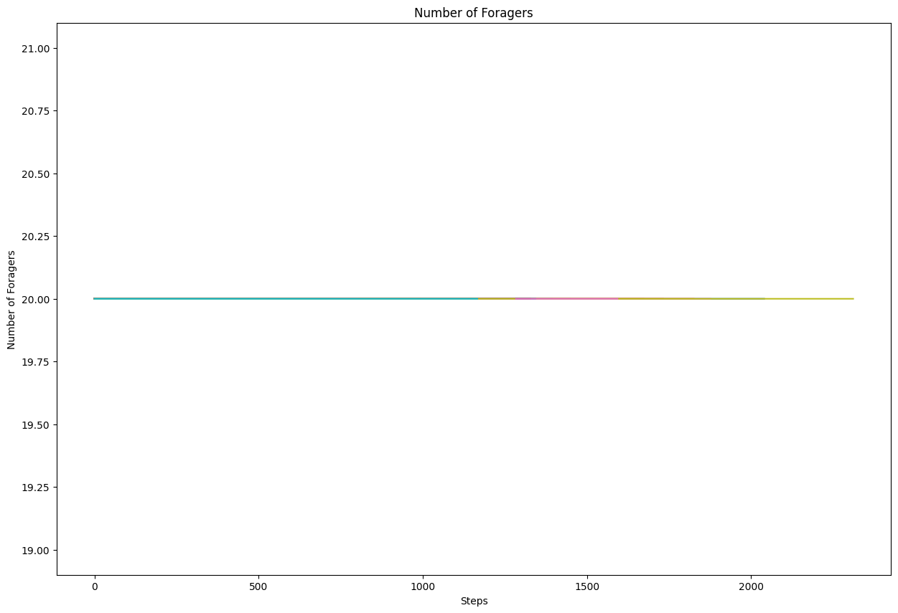

“”

Across the repeated runs, the number of active human hunter-gatherer bands remains constant at 20 for the entire observed period, from the initial step through roughly step 2300, with no increases, decreases, or divergence among simulations. In the context of the Megafauna Hunting Pressure Model, this indicates that human hunting pressure is held at a fixed level throughout this portion of the experiment, consistent with the initial setting of 20 forager bands and the use of immortal foragers, so variation in ungulate population dynamics would be driven by ecological conditions, prey life history, and predation behavior rather than changes in the number of forager bands.

“”  
**PLOT 2**  
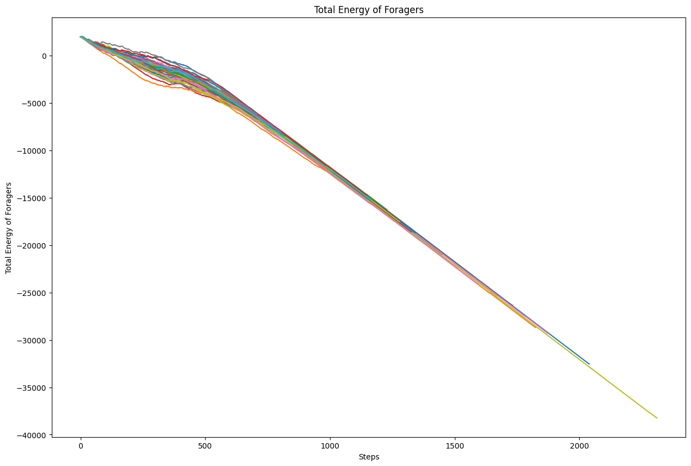

“”Across runs, total forager energy declines continuously from an initial level of roughly 1,800–2,100 at step 0, crossing 0 around steps 180–320 and reaching about \-3,000 to \-4,500 by roughly steps 400–550. After about step 600, the trajectories converge closely and follow an almost perfectly linear downward path, falling to around \-10,000 near steps 850–950, about \-20,000 near 1,400–1,500 steps, and roughly \-32,000 to \-33,000 by about 2,000 steps, with one run continuing to about \-38,000 by roughly 2,300 steps. The main variation occurs early, when some runs lose energy faster than others, but this spread narrows over time. In the MHPM context, this indicates that forager bands begin with a modest positive energy reserve, then rapidly exhaust it and enter a sustained energy deficit, implying that movement and processing costs consistently outweigh energy gains from hunting as the simulation progresses.””

**PLOT 3**  
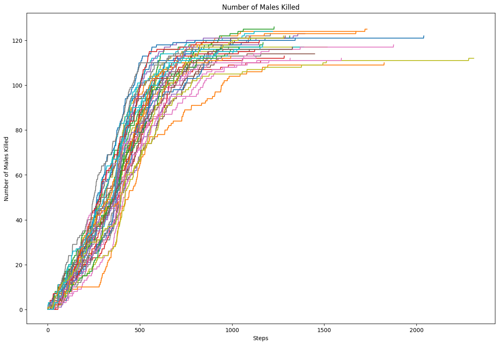

The cumulative number of male prey killed rises quickly and almost monotonically across runs, with little to no decline because the measure is cumulative. In most simulations, kills remain low during the first \~100 steps, then increase steadily to about 20–40 by roughly 200–300 steps and accelerate further between about 300 and 600 steps, when totals commonly reach 70–110. After this main hunting phase, the rate of increase slows: by around 800–1200 steps most runs have accumulated roughly 110–122 male kills, and many trajectories then level off. Final totals cluster tightly, usually ending between about 110 and 125 kills, with only a few reaching the upper 120s, indicating that forager bands remove most hunted males relatively early in the simulation and that male prey availability or encounter success becomes increasingly limited later as the predator–prey system approaches a more stable state under sustained hunting pressure.

**PLOT 4**  
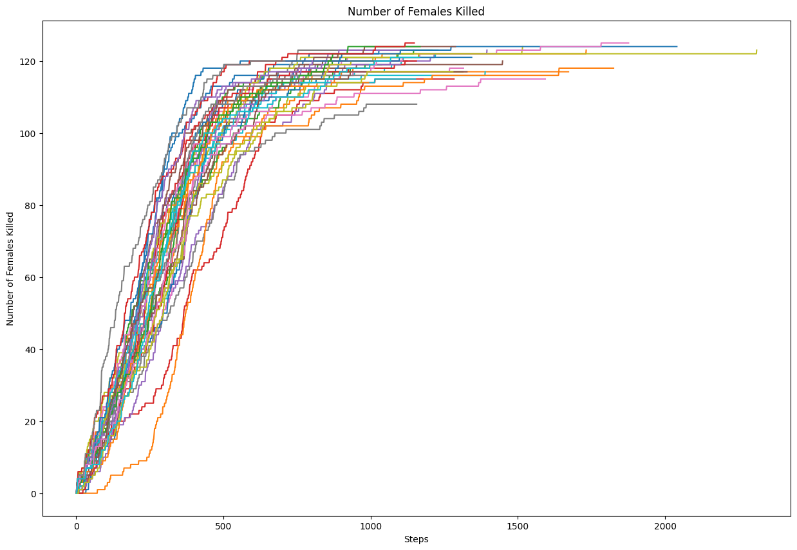

Across runs, cumulative female kills rise monotonically from 0, with most trajectories beginning to increase within the first 50–100 steps and reaching roughly 20–40 kills by about 150–200 steps. The steepest accumulation typically occurs between about 200 and 500 steps, when many simulations climb from around 40–60 kills to approximately 90–110, indicating that forager bands are consistently harvesting adult females during the main phase of hunting pressure. After roughly 500–700 steps, the rate of increase slows, and most runs approach a plateau between about 115 and 125 cumulative female kills. In many cases this near-saturation is reached by around 800–1200 steps, although a few runs continue to add occasional kills out to roughly 1500–2300 steps. This pattern suggests that female prey are removed rapidly early and mid-simulation, then only sporadically later as the available female population becomes depleted under sustained forager pressure in the grassland ungulate system.

**PLOT 5**  
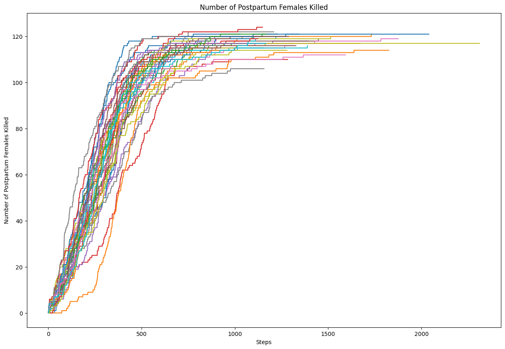

Across runs, cumulative kills of postpartum females rise rapidly early in the simulation, usually reaching about 15–30 by roughly 100 steps and about 40–70 by 200–250 steps, indicating that females with offspring are taken regularly from the beginning under sustained forager pressure. The steepest accumulation generally occurs between about 200 and 500 steps, when most runs climb from around 50–70 kills to roughly 95–115, with many trajectories crossing 100 by about 400–600 steps. After this phase, the rate of increase slows markedly: by about 700–1000 steps, most runs level off near 112–120 cumulative kills, while a few remain lower, around 106–111, and only a small number continue inching upward beyond 1000 steps to about 121–124. In the context of the MHPM, this pattern suggests that hunting pressure removes a large share of reproductive females relatively early, then cumulative losses stabilize as the available pool of postpartum females becomes harder to replenish because reproduction is constrained by birth spacing, mortality, and environmental dynamics in the grassland system.

**PLOT 6**  
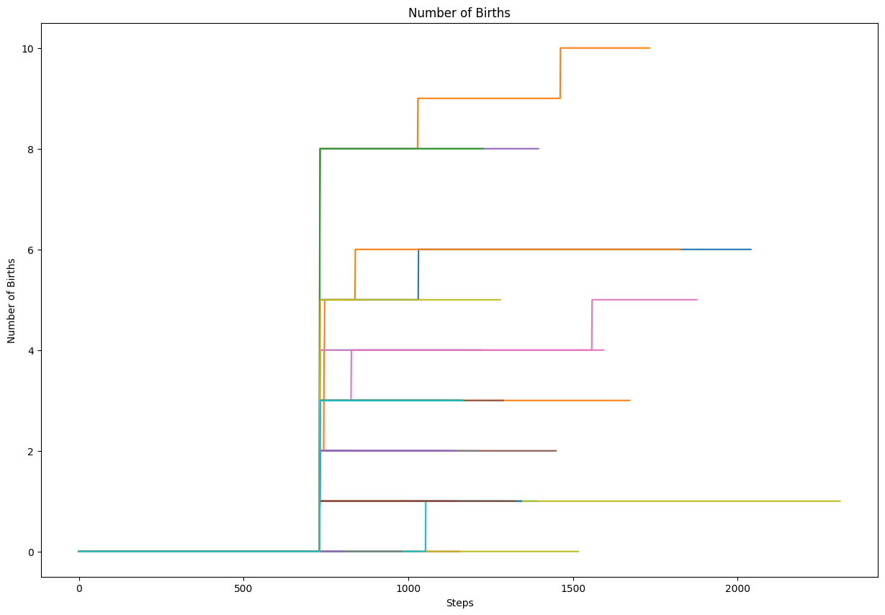

Births are absent through roughly the first 700 steps in every run, after which reproduction begins abruptly, consistent with the model’s long birth spacing and slow large-ungulate life history. Around step 730, cumulative births separate strongly across simulations: some runs rise only to 1–3 births, several reach 4–5, and one reaches about 8 almost immediately. After this first reproductive pulse, most trajectories flatten for extended intervals, then add occasional later increments rather than growing continuously. A second cluster of increases appears around steps 800–1100, when several runs move to about 4–6 births and one reaches about 9 by a little after step 1000\. Later, around steps 1450–1550, a few runs add another birth or two, with the highest trajectory reaching 10 births and then stabilizing, while others level off near 5–8. The lowest-outcome runs remain at 0–1 birth even by the end, whereas mid-range runs stabilize around 3–6. In the context of the MHPM, this pattern indicates intermittent and limited recruitment, with prey reproduction occurring in discrete episodes shaped by the interaction of long reproductive intervals, resource dynamics, survival constraints, and human hunting pressure.

**PLOT 7**  
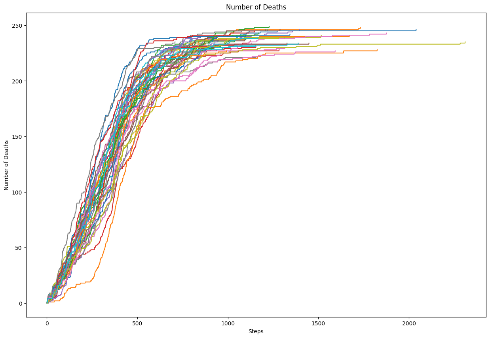

Cumulative prey deaths rise rapidly in every run, starting near zero and reaching roughly 40–80 deaths by about 150–250 steps, then accelerating further to around 100–160 by roughly 300–400 steps and to about 180–220 by around 500–700 steps. After this, the rate of increase slows markedly: most runs approach about 225–245 deaths between roughly 800 and 1200 steps, and many then flatten with only small additional increments. Final totals cluster tightly near the initial prey population size, ending mostly around 230–250 deaths, with a few runs not reaching their final plateau until roughly 1500–2300 steps. In the MHPM context, this pattern indicates that both natural mortality and forager predation remove prey most intensely during the earlier and middle phases of the simulation, after which deaths become infrequent because the remaining ungulate population has been greatly reduced and the interaction among prey life history, environmental constraints, and hunting pressure leaves little scope for continued mortality.

**PLOT 8**  
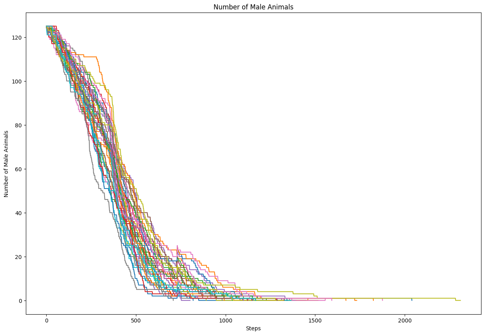

The number of male prey animals declines monotonically across runs, starting at about 125 individuals and falling quickly during the first few hundred steps. By roughly 200–300 steps, most runs are already down to about 80–110 males, and by around 400–600 steps they have usually dropped further to roughly 20–60. After this, the decline continues but at a slower pace, with most simulations reaching fewer than 10 males by about 700–1000 steps. In many runs the male population reaches zero shortly after 800–1200 steps, while a smaller number persist at very low levels for much longer, in some cases surviving until roughly 1500–2300 steps before disappearing. In the MHPM context, this pattern indicates a sustained attrition of adult males under combined background mortality, resource limits, and repeated human predation pressure, with little evidence of recovery once numbers become low.

**PLOT 9**  
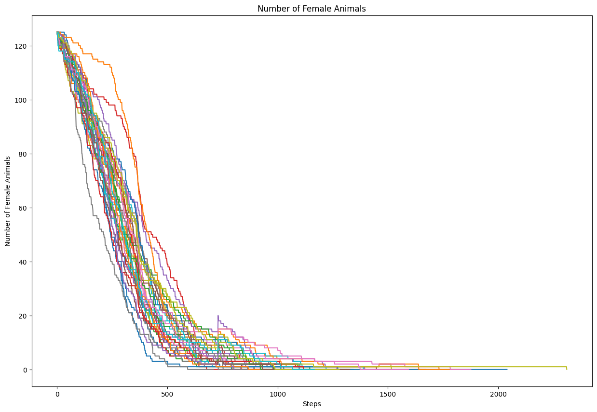

The female prey population starts at roughly 125 individuals and declines steeply across all runs, with most simulations falling below about 100 by roughly 100–180 steps and below about 60 by around 250–350 steps. By approximately 400–500 steps, many runs are down to about 10–30 females, and by 600–800 steps most have reached single digits or zero, although a few trajectories retain small remnant populations of around 5–20 females slightly longer. After about 900–1200 steps, nearly all runs are at or near zero, with only rare survivors persisting at 1–3 individuals until roughly 1500–2300 steps before disappearing entirely. In the context of the MHPM, this pattern indicates a rapid collapse of the breeding female segment of the ungulate population under the combined effects of background mortality, resource constraints in a seasonal grassland, and sustained human predation pressure, with limited persistence of small residual groups before local extinction.

**PLOT 10**  
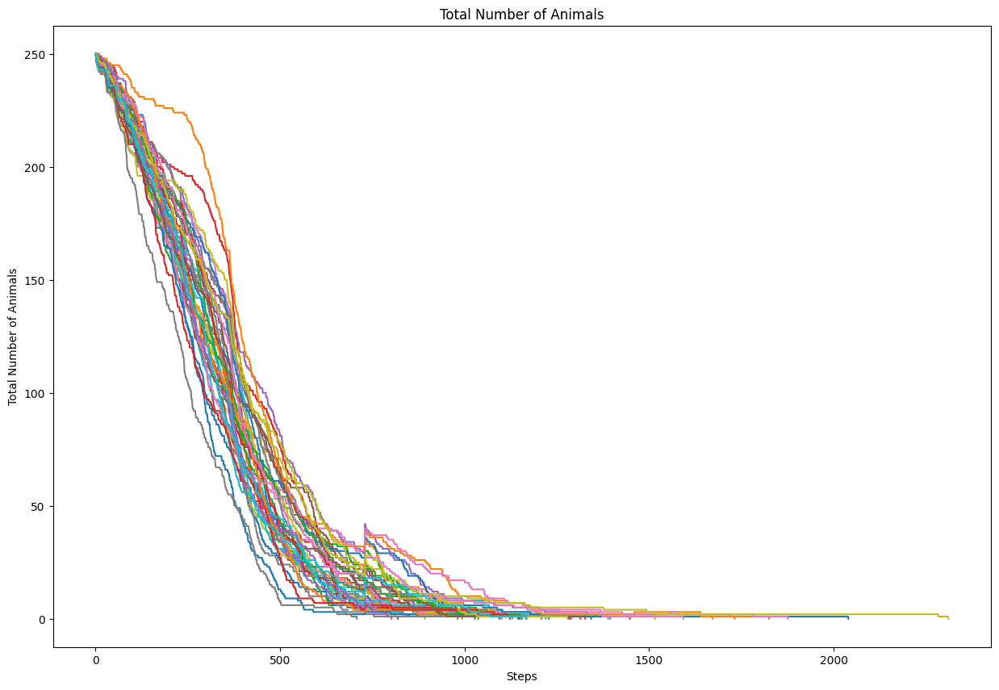

The total prey population begins at about 250 individuals and declines rapidly in every run, indicating sustained pressure on the herbivore population under the combined effects of mortality, resource dynamics, and human predation. By roughly 200 steps, most runs have already fallen to about 150–210 animals, and by around 350–500 steps the population usually drops further to roughly 40–100, with several runs already nearing 20 or less. After about 500–700 steps, most trajectories converge to very low abundance, generally below 20 animals, although a few runs show brief small rebounds around 700 steps, reaching only about 30–40 before resuming decline. From roughly 900–1200 steps onward, nearly all runs are at or near zero, and the remaining survivors disappear gradually, with a few long-tail cases persisting at 1–5 individuals until about 1500–2300 steps. In the MHPM context, this pattern reflects a strongly non-linear collapse in total ungulate abundance in which environmental constraints and hunting pressure reduce the herd quickly at first, then leave only small remnant populations that persist briefly before extinction.

**PLOT 11**  
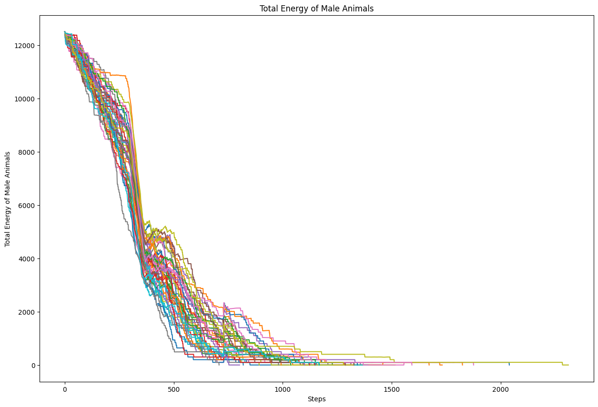

The combined male prey energy begins at roughly 12,300–12,500 units and declines quickly across all runs, falling to about 9,000–11,000 by around 150–250 steps. A sharper collapse then occurs near 300–400 steps, when total male energy typically drops to roughly 3,000–5,000, indicating a major contraction in the energetic contribution of males under the combined effects of mortality, movement costs, feeding limits, and hunting pressure in the model. After this break, the decline continues more gradually: by about 500–800 steps most runs are below 2,000, and many are already under 500–1,000. Near 900–1,200 steps the total male energy is close to zero in most simulations, with only a few runs retaining small residual values that persist longer, sometimes to about 1,500–2,300 steps. In context, this pattern shows that male prey energy is depleted early and persistently as the ungulate population contracts, consistent with strong interaction between resource dynamics and sustained human predation in driving downward population energy over time.

**PLOT 12**  
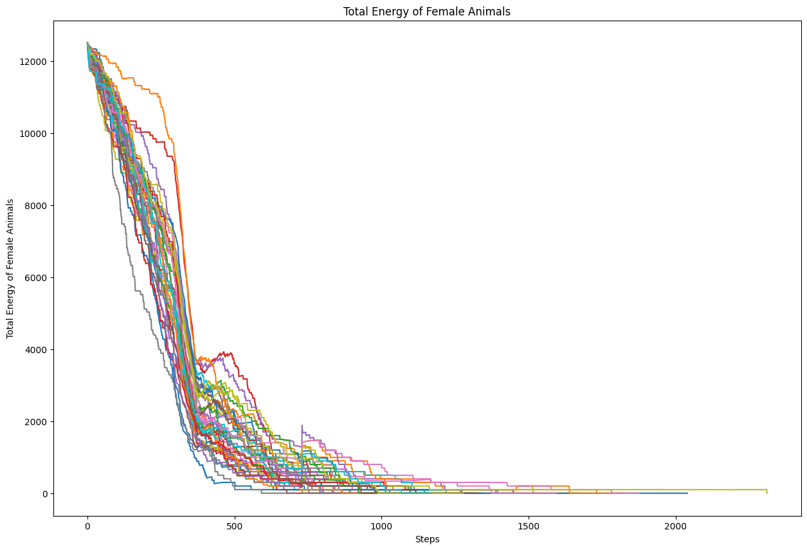

Across repeated runs, the combined energy held by female prey begins at roughly 12,200–12,500 and then declines steeply almost immediately, with most simulations falling to about 8,000–10,000 by around 100 steps and to roughly 3,000–7,000 by about 200–300 steps. A sharper collapse usually follows between about 300 and 450 steps, when many runs drop to roughly 1,000–3,500, although a few briefly stabilize or rebound near 3,500–3,900 around 400–500 steps. After about 500–700 steps, the total female energy is typically below 2,000 and continues to taper downward with smaller, short-lived fluctuations, reaching only a few hundred units in many runs by about 800–1,100 steps. Most simulations approach zero between roughly 1,000 and 1,600 steps, while a few persist at very low levels until around 2,000–2,300 steps. In the MHPM context, this pattern indicates a rapid depletion of energy in the female ungulate population under the combined effects of movement costs, mortality, limited resource recovery, and sustained human hunting pressure, with only brief periods where surviving females maintain enough resources to slow the decline.

**PLOT 13**  
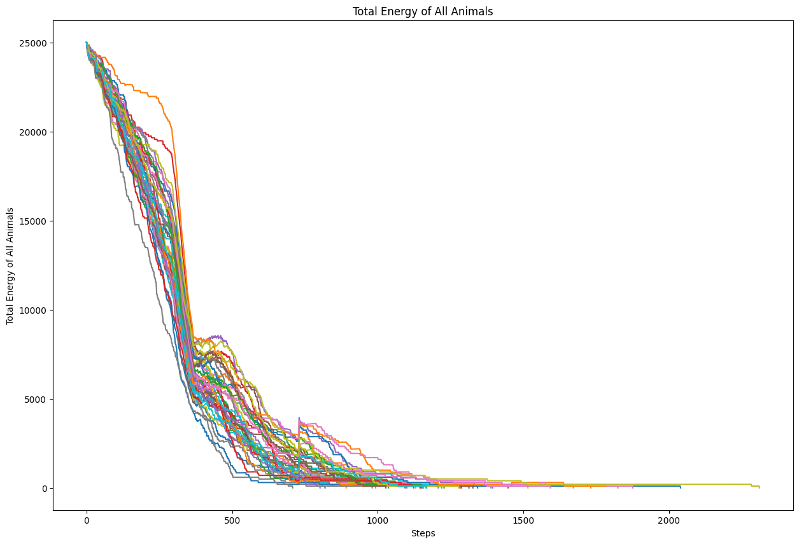

Across runs, the combined prey-energy pool starts near 25,000 at step 0 and declines rapidly throughout the early simulation, usually falling to about 18,000–22,000 by roughly 100 steps and to around 12,000–16,000 by about 200 steps. A sharper collapse typically occurs between about 250 and 400 steps, when total prey energy drops from roughly 10,000–15,000 to about 5,000–8,000, and then continues downward to around 2,000–5,000 by about 500–700 steps. After this point, most runs enter a low-energy phase with only small temporary plateaus or modest rebounds, generally below 4,000, before declining further toward near-zero values by roughly 900–1,300 steps in many cases; a smaller number of runs persist longer at very low energy levels until about 1,500–2,300 steps. In the MHPM context, this pattern indicates that the total energetic resources embodied in the prey population are progressively depleted as ungulate numbers and condition are reduced through the combined effects of environmental constraints, movement and survival costs, and continued human hunting pressure, with little evidence of sustained recovery once the mid-simulation collapse begins.

**PLOT 14**  
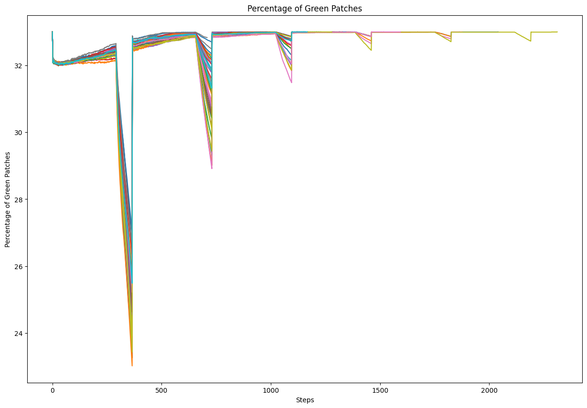

The proportion of vegetated patches remains high and tightly bounded for most of the run, generally close to the initial grass proportion of about 33%, indicating that fodder availability is usually maintained near carrying levels despite prey grazing. After a brief early adjustment from roughly 32.8% to about 32.0–32.1% at the start, the system gradually recovers to around 32.6–32.9% by about steps 500–650. The main deviation occurs near step 350, when green cover drops sharply across runs to about 23.0–25.6%, consistent with a short-lived but severe episode of grass depletion under seasonal pressure and herbivore consumption; this is followed by a rapid return to about 32.8–33.0% immediately afterward, reflecting fast regrowth under the model’s short regrowth time. Smaller synchronized declines recur later, especially around steps 700, 1080–1100, 1450, 1820, and 2180, with minima of roughly 28.9–31.9%, but each is brief and followed by recovery to near 33.0%. Overall, the landscape remains predominantly green, suggesting that vegetation dynamics are strongly resilient and that prey usually experience only intermittent, short-duration reductions in forage availability rather than prolonged resource scarcity.

### Long Ground Truth

We created our ABM simulation model, which we call the ‘Megafauna Hunting Pressure Model’ (MHPM), using the NetLogo modeling platform”; “The MHPM is a model of large-bodied ungulate population dynamics with human predation in a simplified, but dynamic grassland environment”; “The overall purpose of the model is to understand how environmental dynamics and human predation preferences interact with ungulate life history characteristics to affect ungulate population dynamics over time”; “Using the extinction of *Syncerus antiquus* in South Africa at 12–10 ka as a loose inspirational case study, we parameterized a set of experiments to identify cross-feedbacks among environmental dynamics, prey life history, and human hunting pressure that affect extinction probability in a non-linear way”; “The MHPM contains individual prey animals, forager bands, and landscape patches as entities”; key parameters are: init-foragers (0.0–100.0; set 20), processing-cost-males (0.0–20.0; set 6), food-value-males (5.0–100.0; set 30), maximum-lifespan (0.0–12000.0; set 10220), processing-cost-females (0.0–20.0; set 3), food-value-females (5.0–100.0; set 27), init-prey (0.0–1000.0; set 250), internal-mortality (0.0–0.2; set 0.025), age-of-senescence (0.0–10000.0; set 7300), ticks-per-year (0.0–720.0; set 365), animals-gain-from-food (0.0–10.0; set 1.5), animals-starvation-threshold (0.0–100.0; set 25), animals-movement-cost (0.0–10.0; set 1), foragers-movement-cost (0.0–10.0; set 1), grass-proportion (0.0–1.0; set 0.33), external-mortality (0.0–0.2; set 0.0025), birth-spacing (0.0–1000.0; set 730), foraging-radius (1.0–100.0; set 6), food-value-calf (0.0–20.0; set 3), seasonality (0.0–1.0; set 0.8), regrowth-time (0.0–365.0; set 3), stop-at-max-ticks (set True), stop-at-max-herd-size (set False), grass-growth (set True), keep-initial-grass-pattern (set True), immortal-foragers (set True), food-storage (set True), max-ticks (set 73000), and max-herd-size (set 500).

Across the repeated runs, the number of active human hunter-gatherer bands remains constant at 20 for the entire observed period, from the initial step through roughly step 2300, with no increases, decreases, or divergence among simulations. In the context of the Megafauna Hunting Pressure Model, this indicates that human hunting pressure is held at a fixed level throughout this portion of the experiment, consistent with the initial setting of 20 forager bands and the use of immortal foragers, so variation in ungulate population dynamics would be driven by ecological conditions, prey life history, and predation behavior rather than changes in the number of forager bands.

Across runs, total forager energy declines continuously from an initial level of roughly 1,800–2,100 at step 0, crossing 0 around steps 180–320 and reaching about \-3,000 to \-4,500 by roughly steps 400–550. After about step 600, the trajectories converge closely and follow an almost perfectly linear downward path, falling to around \-10,000 near steps 850–950, about \-20,000 near 1,400–1,500 steps, and roughly \-32,000 to \-33,000 by about 2,000 steps, with one run continuing to about \-38,000 by roughly 2,300 steps. The main variation occurs early, when some runs lose energy faster than others, but this spread narrows over time. In the MHPM context, this indicates that forager bands begin with a modest positive energy reserve, then rapidly exhaust it and enter a sustained energy deficit, implying that movement and processing costs consistently outweigh energy gains from hunting as the simulation progresses.

The cumulative number of male prey killed rises quickly and almost monotonically across runs, with little to no decline because the measure is cumulative. In most simulations, kills remain low during the first \~100 steps, then increase steadily to about 20–40 by roughly 200–300 steps and accelerate further between about 300 and 600 steps, when totals commonly reach 70–110. After this main hunting phase, the rate of increase slows: by around 800–1200 steps most runs have accumulated roughly 110–122 male kills, and many trajectories then level off. Final totals cluster tightly, usually ending between about 110 and 125 kills, with only a few reaching the upper 120s, indicating that forager bands remove most hunted males relatively early in the simulation and that male prey availability or encounter success becomes increasingly limited later as the predator–prey system approaches a more stable state under sustained hunting pressure.

Across runs, cumulative female kills rise monotonically from 0, with most trajectories beginning to increase within the first 50–100 steps and reaching roughly 20–40 kills by about 150–200 steps. The steepest accumulation typically occurs between about 200 and 500 steps, when many simulations climb from around 40–60 kills to approximately 90–110, indicating that forager bands are consistently harvesting adult females during the main phase of hunting pressure. After roughly 500–700 steps, the rate of increase slows, and most runs approach a plateau between about 115 and 125 cumulative female kills. In many cases this near-saturation is reached by around 800–1200 steps, although a few runs continue to add occasional kills out to roughly 1500–2300 steps. This pattern suggests that female prey are removed rapidly early and mid-simulation, then only sporadically later as the available female population becomes depleted under sustained forager pressure in the grassland ungulate system.

Across runs, cumulative kills of postpartum females rise rapidly early in the simulation, usually reaching about 15–30 by roughly 100 steps and about 40–70 by 200–250 steps, indicating that females with offspring are taken regularly from the beginning under sustained forager pressure. The steepest accumulation generally occurs between about 200 and 500 steps, when most runs climb from around 50–70 kills to roughly 95–115, with many trajectories crossing 100 by about 400–600 steps. After this phase, the rate of increase slows markedly: by about 700–1000 steps, most runs level off near 112–120 cumulative kills, while a few remain lower, around 106–111, and only a small number continue inching upward beyond 1000 steps to about 121–124. In the context of the MHPM, this pattern suggests that hunting pressure removes a large share of reproductive females relatively early, then cumulative losses stabilize as the available pool of postpartum females becomes harder to replenish because reproduction is constrained by birth spacing, mortality, and environmental dynamics in the grassland system.

Births are absent through roughly the first 700 steps in every run, after which reproduction begins abruptly, consistent with the model’s long birth spacing and slow large-ungulate life history. Around step 730, cumulative births separate strongly across simulations: some runs rise only to 1–3 births, several reach 4–5, and one reaches about 8 almost immediately. After this first reproductive pulse, most trajectories flatten for extended intervals, then add occasional later increments rather than growing continuously. A second cluster of increases appears around steps 800–1100, when several runs move to about 4–6 births and one reaches about 9 by a little after step 1000\. Later, around steps 1450–1550, a few runs add another birth or two, with the highest trajectory reaching 10 births and then stabilizing, while others level off near 5–8. The lowest-outcome runs remain at 0–1 birth even by the end, whereas mid-range runs stabilize around 3–6. In the context of the MHPM, this pattern indicates intermittent and limited recruitment, with prey reproduction occurring in discrete episodes shaped by the interaction of long reproductive intervals, resource dynamics, survival constraints, and human hunting pressure.

Cumulative prey deaths rise rapidly in every run, starting near zero and reaching roughly 40–80 deaths by about 150–250 steps, then accelerating further to around 100–160 by roughly 300–400 steps and to about 180–220 by around 500–700 steps. After this, the rate of increase slows markedly: most runs approach about 225–245 deaths between roughly 800 and 1200 steps, and many then flatten with only small additional increments. Final totals cluster tightly near the initial prey population size, ending mostly around 230–250 deaths, with a few runs not reaching their final plateau until roughly 1500–2300 steps. In the MHPM context, this pattern indicates that both natural mortality and forager predation remove prey most intensely during the earlier and middle phases of the simulation, after which deaths become infrequent because the remaining ungulate population has been greatly reduced and the interaction among prey life history, environmental constraints, and hunting pressure leaves little scope for continued mortality.

The number of male prey animals declines monotonically across runs, starting at about 125 individuals and falling quickly during the first few hundred steps. By roughly 200–300 steps, most runs are already down to about 80–110 males, and by around 400–600 steps they have usually dropped further to roughly 20–60. After this, the decline continues but at a slower pace, with most simulations reaching fewer than 10 males by about 700–1000 steps. In many runs the male population reaches zero shortly after 800–1200 steps, while a smaller number persist at very low levels for much longer, in some cases surviving until roughly 1500–2300 steps before disappearing. In the MHPM context, this pattern indicates a sustained attrition of adult males under combined background mortality, resource limits, and repeated human predation pressure, with little evidence of recovery once numbers become low.

The female prey population starts at roughly 125 individuals and declines steeply across all runs, with most simulations falling below about 100 by roughly 100–180 steps and below about 60 by around 250–350 steps. By approximately 400–500 steps, many runs are down to about 10–30 females, and by 600–800 steps most have reached single digits or zero, although a few trajectories retain small remnant populations of around 5–20 females slightly longer. After about 900–1200 steps, nearly all runs are at or near zero, with only rare survivors persisting at 1–3 individuals until roughly 1500–2300 steps before disappearing entirely. In the context of the MHPM, this pattern indicates a rapid collapse of the breeding female segment of the ungulate population under the combined effects of background mortality, resource constraints in a seasonal grassland, and sustained human predation pressure, with limited persistence of small residual groups before local extinction.

The total prey population begins at about 250 individuals and declines rapidly in every run, indicating sustained pressure on the herbivore population under the combined effects of mortality, resource dynamics, and human predation. By roughly 200 steps, most runs have already fallen to about 150–210 animals, and by around 350–500 steps the population usually drops further to roughly 40–100, with several runs already nearing 20 or less. After about 500–700 steps, most trajectories converge to very low abundance, generally below 20 animals, although a few runs show brief small rebounds around 700 steps, reaching only about 30–40 before resuming decline. From roughly 900–1200 steps onward, nearly all runs are at or near zero, and the remaining survivors disappear gradually, with a few long-tail cases persisting at 1–5 individuals until about 1500–2300 steps. In the MHPM context, this pattern reflects a strongly non-linear collapse in total ungulate abundance in which environmental constraints and hunting pressure reduce the herd quickly at first, then leave only small remnant populations that persist briefly before extinction.

The combined male prey energy begins at roughly 12,300–12,500 units and declines quickly across all runs, falling to about 9,000–11,000 by around 150–250 steps. A sharper collapse then occurs near 300–400 steps, when total male energy typically drops to roughly 3,000–5,000, indicating a major contraction in the energetic contribution of males under the combined effects of mortality, movement costs, feeding limits, and hunting pressure in the model. After this break, the decline continues more gradually: by about 500–800 steps most runs are below 2,000, and many are already under 500–1,000. Near 900–1,200 steps the total male energy is close to zero in most simulations, with only a few runs retaining small residual values that persist longer, sometimes to about 1,500–2,300 steps. In context, this pattern shows that male prey energy is depleted early and persistently as the ungulate population contracts, consistent with strong interaction between resource dynamics and sustained human predation in driving downward population energy over time.

Across repeated runs, the combined energy held by female prey begins at roughly 12,200–12,500 and then declines steeply almost immediately, with most simulations falling to about 8,000–10,000 by around 100 steps and to roughly 3,000–7,000 by about 200–300 steps. A sharper collapse usually follows between about 300 and 450 steps, when many runs drop to roughly 1,000–3,500, although a few briefly stabilize or rebound near 3,500–3,900 around 400–500 steps. After about 500–700 steps, the total female energy is typically below 2,000 and continues to taper downward with smaller, short-lived fluctuations, reaching only a few hundred units in many runs by about 800–1,100 steps. Most simulations approach zero between roughly 1,000 and 1,600 steps, while a few persist at very low levels until around 2,000–2,300 steps. In the MHPM context, this pattern indicates a rapid depletion of energy in the female ungulate population under the combined effects of movement costs, mortality, limited resource recovery, and sustained human hunting pressure, with only brief periods where surviving females maintain enough resources to slow the decline.

Across runs, the combined prey-energy pool starts near 25,000 at step 0 and declines rapidly throughout the early simulation, usually falling to about 18,000–22,000 by roughly 100 steps and to around 12,000–16,000 by about 200 steps. A sharper collapse typically occurs between about 250 and 400 steps, when total prey energy drops from roughly 10,000–15,000 to about 5,000–8,000, and then continues downward to around 2,000–5,000 by about 500–700 steps. After this point, most runs enter a low-energy phase with only small temporary plateaus or modest rebounds, generally below 4,000, before declining further toward near-zero values by roughly 900–1,300 steps in many cases; a smaller number of runs persist longer at very low energy levels until about 1,500–2,300 steps. In the MHPM context, this pattern indicates that the total energetic resources embodied in the prey population are progressively depleted as ungulate numbers and condition are reduced through the combined effects of environmental constraints, movement and survival costs, and continued human hunting pressure, with little evidence of sustained recovery once the mid-simulation collapse begins.

The proportion of vegetated patches remains high and tightly bounded for most of the run, generally close to the initial grass proportion of about 33%, indicating that fodder availability is usually maintained near carrying levels despite prey grazing. After a brief early adjustment from roughly 32.8% to about 32.0–32.1% at the start, the system gradually recovers to around 32.6–32.9% by about steps 500–650. The main deviation occurs near step 350, when green cover drops sharply across runs to about 23.0–25.6%, consistent with a short-lived but severe episode of grass depletion under seasonal pressure and herbivore consumption; this is followed by a rapid return to about 32.8–33.0% immediately afterward, reflecting fast regrowth under the model’s short regrowth time. Smaller synchronized declines recur later, especially around steps 700, 1080–1100, 1450, 1820, and 2180, with minima of roughly 28.9–31.9%, but each is brief and followed by recovery to near 33.0%. Overall, the landscape remains predominantly green, suggesting that vegetation dynamics are strongly resilient and that prey usually experience only intermittent, short-duration reductions in forage availability rather than prolonged resource scarcity.

### Summary Prompt

summary\_prompt: 

“””

You are given a narrative description of an Agent Based Model simulation. Your goal is to provide a summary of this description. Your output should be structured as a 3 to 4 paragraphs long summary. The first paragraph should present the context and parameters while the following paragraphs should describe key simulation trends. Here is the narrative description: “**long\_ground\_truth**”

“””

### Short Ground Truth

The Megafauna Hunting Pressure Model (MHPM) is an agent-based model built in NetLogo to study large-bodied ungulate population dynamics under human predation in a dynamic grassland environment, loosely inspired by the extinction of *Syncerus antiquus* in South Africa during 12–10 ka. Its purpose is to examine how environmental dynamics, prey life history, and hunting preferences interact to shape extinction risk through non-linear feedbacks. The model includes individual prey animals, forager bands, and landscape patches, and is parameterized with 20 initial forager bands, 250 initial prey, a maximum lifespan of 10,220 ticks, senescence at 7,300, birth spacing of 730, 365 ticks per year, grass proportion of 0.33, seasonality of 0.8, regrowth time of 3, and fixed settings such as immortal foragers, food storage, grass growth, and a run length capped at 73,000 ticks. Additional energetic and mortality parameters govern prey movement, starvation, food values, processing costs, and internal and external mortality.

Across repeated runs, human hunting pressure remains fixed because the number of active forager bands stays constant at 20 throughout the observed period. Even so, forager energy declines from an initial positive reserve to negative values within the first few hundred steps, then continues downward almost linearly, showing that energetic costs consistently exceed returns from hunting over time. Hunting mortality accumulates rapidly early in the simulation: male kills, female kills, and postpartum female kills all increase steeply during the first few hundred steps and then level off, usually reaching plateaus around 110–125 cumulative kills. This indicates that most successful hunting occurs early and mid-simulation, after which prey become scarce and additional kills are only sporadic.

Prey demography shows a strong collapse with very limited recovery. Births are absent until about step 700, then occur only in intermittent, small pulses, with most runs ending with very few total births. At the same time, cumulative deaths rise quickly toward the initial population size, implying that mortality overwhelmingly outpaces recruitment. Male and female prey populations both fall sharply from roughly 125 each at the start to very small remnant populations within several hundred steps, and most runs reach near-zero or zero by roughly 900–1200 steps, with only a few lingering survivors in longer tails. As a result, the total prey population declines from about 250 to near extinction across nearly all runs, showing a strongly non-linear collapse under sustained hunting pressure combined with background mortality and ecological constraints.

The energetic trends mirror this demographic decline. Male prey energy, female prey energy, and the combined prey-energy pool all begin at high values, fall rapidly during the first few hundred steps, and then approach near-zero as the herd collapses. Female energy declines especially steeply, with only brief minor rebounds, while male energy also contracts sharply before fading out. Vegetation, by contrast, remains comparatively resilient: the proportion of vegetated patches stays close to the initial 33% for most of the simulation, apart from short synchronized dips that recover quickly because regrowth is fast. This suggests that long-term prey collapse is not driven by persistent vegetation failure, but rather by the interaction of sustained predation, prey mortality, slow reproduction, and only brief interruptions in forage availability.

## Grazing

### Source Article

https://www.sciencedirect.com/science/article/abs/pii/S1476945X18300989?via%3Dihub

### Context Response

The following context response was generated with GPT-5.2 Thinking using the shared context prompt reported in the Method section. The response is reproduced verbatim.

“We use an agent-based model to examine long-term social-ecological consequences and implications for system resilience of such behavioral changes”; “The model captures feedback between pastures, livestock and household livelihood in a common property grazing system”; “We model a stylized common property grazing system in which households follow a certain behavioral type that specifies how they choose pastures on which they relocate, feed and breed their herds”; “We consider three household behavioral types that reflect empirically observed trends of behavioral change in different dryland regions” and “assess the social-ecological consequences of scenarios of behavioral and demographic change”; the parameters are: number-households (1.0–100.0, set to 60), satisficing-threshold (0.0–100.0, set to 0), satisficing-trials (0.0–100.0, set to 21), knowledge-radius (0.0–5.0, set to 1), resting-threshold (0.0–1.0, set to 0.1), intrinsic-preference (0.0–1.0, set to 0), social-susceptibility (0.0–1.0, set to 0), global-rain? (set to True), start-on-homepatch? (set to True), resting? (set to False), homog-behav-types? (set to True), extension-model? (set to True), SL2-strategy-switch? (set to False), risk-mode? (set to True), behavioral-type (set to E-RO), number-SAT (set to 0), number-E-RO (set to 20), number-TRAD (set to 0), b (set to 0), number-MAX (set to 0), rain-mean (set to 200), risk-att-init (set to 0.5), gr1 (set to 0.5), number-E-LBD (set to 20), gr2 (set to 0.1), number-E-RO-SL1 (set to 20), timesteps (set to 100), w (set to 0.8), number-random (set to 0), livestock-init (set to 90), and rain-std (set to 100); “Using the model, we assess the social-ecological consequences of scenarios of behavioral and demographic change” and address “Under which demographic conditions (number of pastoralist households) do differences in decision-making matter,” “When can behavioral types increase the risk for long-term negative effects such as pasture degradation and livestock loss,” and “How does behavioral change affect the resilience of the SES over the long term?”

### Plot Descriptions

For this ABM, the metric descriptions associated with the plot-level prompt are as follows.

plot\_descriptions: “””

1\. "This plot represents the average initial risk attitude of all social learning agents, used to store and report their initial disposition to deviate from the recommended number of livestock."

 2\. "This plot represents the average degree of deviation from the recommended number of livestock for all extension agents during the simulation."

 3\. "This plot represents the average amount of reserve biomass available across all patches, indicating the overall biomass condition in the model's grazing system."

 4\. "This plot represents the average amount of actual available green biomass across all patches, accounting for reductions due to grazing."

 5\. "This plot represents the average total number of livestock, including both healthy livestock and those that have been destocked, across all households."

 6\. "This plot represents the average number of livestock that have been destocked, or removed due to insufficient resources, across all households."

  7\. "This plot represents the inequality in the distribution of healthy livestock across all households."

 8\. "This plot represents the number of households that have engaged in social learning, indicated by the variable household-SL being true."

 9\. "This plot represents the average cumulative number of livestock that have been destocked across all households."

10\. "This plot represents the number of households that follow the E-RO strategy, indicating households with non learning agents."

“””

### Plot-Level Responses

The following plot-level descriptions were generated with GPT-5.2 Thinking using the shared trend prompt reported in the Method section. Each response is reproduced verbatim.

**PLOT 1:** 

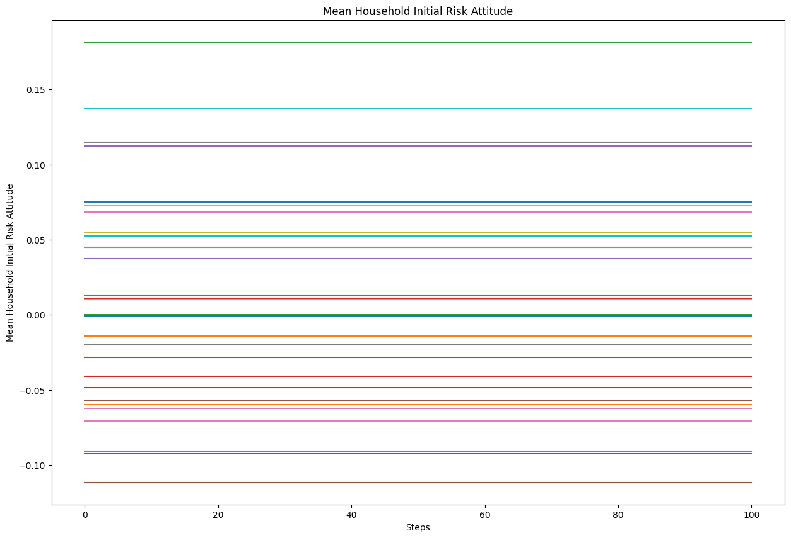

Across the full 100 time steps, the mean household initial risk attitude remains constant within each run, with no upward or downward movement after initialization. At step 0, values are distributed across a wide range, from about \-0.11 at the low end to about 0.18 at the high end, with several runs clustered near 0, others around 0.04–0.08, and a smaller number around 0.11–0.14. These same values are preserved unchanged through step 50 and step 100, indicating that this metric functions as a fixed initial trait rather than a dynamically updated state variable. In the context of the model, this means households begin with different predispositions to deviate from the recommended livestock level, and those starting differences are carried through the simulation as stable behavioral heterogeneity while the longer-term social-ecological consequences unfold through other interacting processes.

**PLOT 2:**   
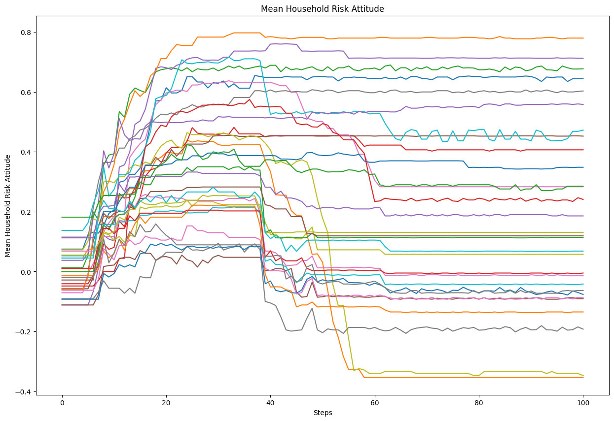

Across the 100 steps, the average deviation from the recommended livestock level begins close to zero, with most runs between about \-0.1 and 0.15 during the first 5 steps, then rises quickly between roughly steps 5 and 20 as many trajectories move into the 0.2-0.6 range and some climb higher to about 0.7-0.8 by steps 20-35. This early increase indicates that extension agents initially shift toward stronger departures from the recommended herd size, consistent with a system in which behavioral rules and environmental feedbacks rapidly alter stocking decisions. Around steps 38-45, many trajectories show an abrupt downward adjustment, often dropping by about 0.1-0.4, and from steps 50-60 several runs decline further to near zero or into negative values, with the lowest settling around \-0.35 while others remain positive near 0.1-0.2, 0.25-0.35, 0.4-0.5, and a smaller group staying high around 0.6-0.78. From about step 60 to the end, most trajectories stabilize with only minor fluctuations, showing that the model produces a persistent spread of outcomes ranging from below-recommendation stocking to sustained above-recommendation stocking, reflecting divergent long-term behavioral responses of extension agents under the same common-property grazing conditions.

**PLOT 3:** 

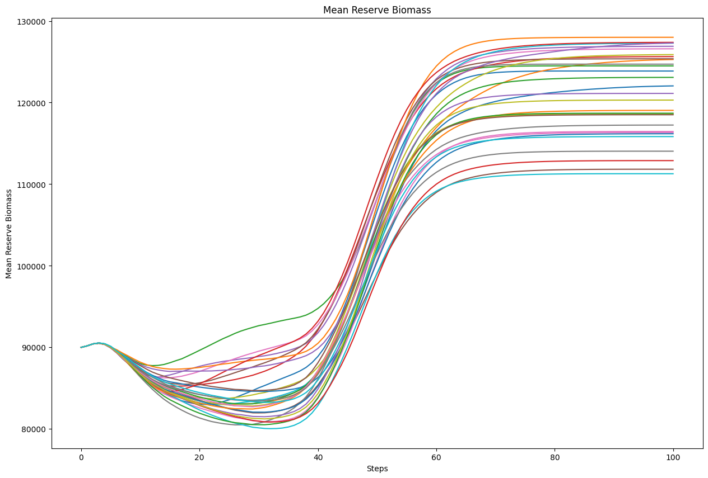

The average reserve biomass begins near 90,000 at step 0, shows a small early uptick to just above 90,000 in the first few steps, and then declines steadily through roughly steps 5–30, with most runs reaching a minimum around 80,000–85,000 and a few staying closer to 87,000–93,000. From about steps 35–45, reserve biomass turns upward, and between roughly steps 45 and 60 it increases rapidly, passing about 100,000 near step 50 and commonly reaching 115,000–123,000 by step 60\. After this recovery phase, growth slows and the trajectories level off from around steps 65–80 onward, with long-run values distributed mostly between about 111,000 and 128,000 by step 100\. In the context of the grazing system, this pattern indicates an initial period of biomass drawdown across patches, consistent with grazing pressure reducing reserves, followed by a broad recovery and stabilization of pasture biomass as feedbacks among herd behavior, patch use, and environmental conditions shift the system toward a higher-biomass state.

**PLOT 4:**   
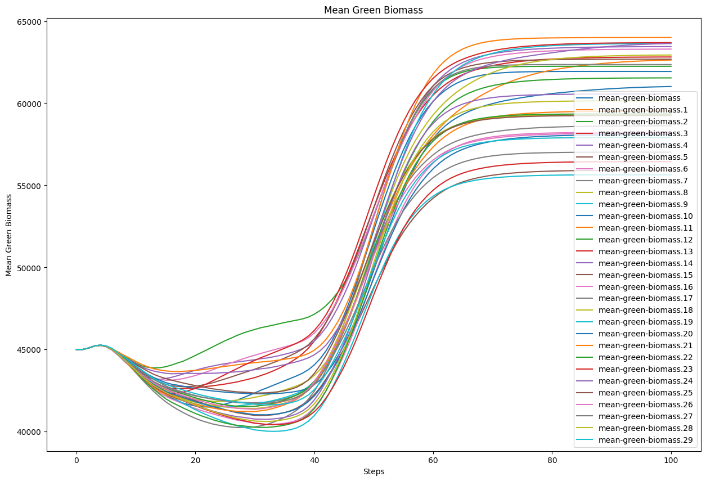

Across runs, mean available green biomass begins near 45,000, shows a very small early rise to roughly 45,200–45,300 in the first few steps, and then declines steadily under grazing pressure, reaching about 42,000–44,000 by steps 15–20 and a broad minimum of roughly 40,000–42,000 around steps 30–40, with a few runs remaining slightly higher near 46,000–47,000. After about step 40, the system shifts from depletion to recovery: biomass rises rapidly through steps 45–60, crossing about 50,000 near step 50 and reaching roughly 58,000–62,000 by step 60\. Beyond that point, recovery slows and the trajectories level off, ending by steps 70–100 on distinct plateaus mostly between about 55,500 and 64,000. In the context of the common-property grazing system, this pattern indicates an initial phase in which livestock use reduces forage availability across patches, followed by a strong regeneration phase in which pasture biomass rebounds and stabilizes, with the spread in final levels showing that different stochastic realizations produce somewhat different long-run pasture conditions under the same behavioral setting.

**PLOT 5:**   
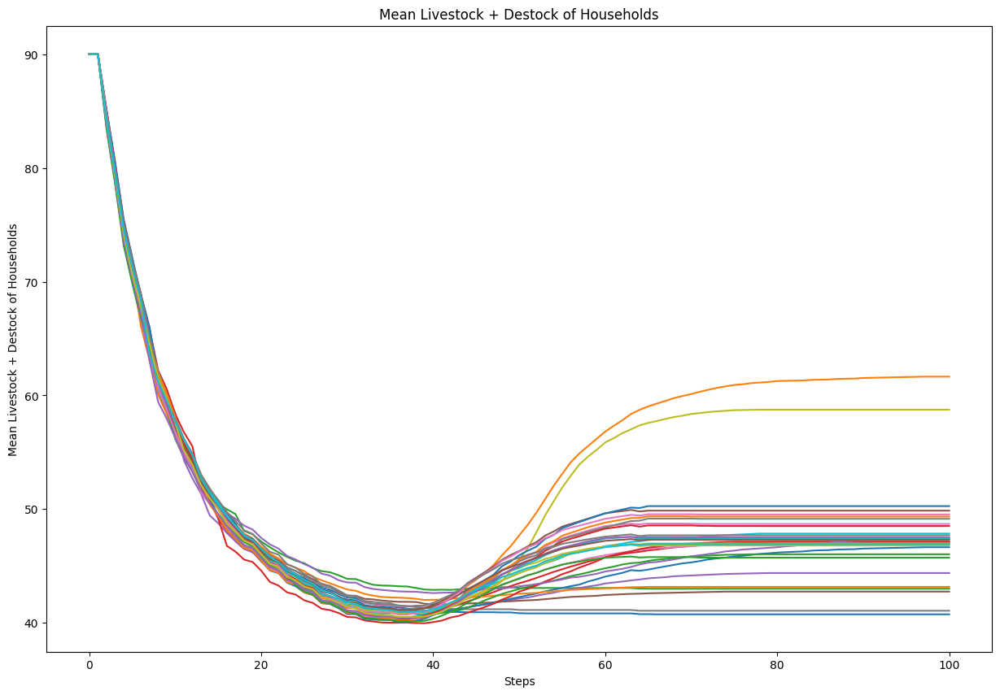

The average total livestock per household, including animals that remain in herds and those that have been destocked, begins at about 90 and falls rapidly during the first part of the simulation, dropping to roughly 75 by step 5, around 60–62 by step 10, and to about 48–50 by steps 18–20. The decline then continues more gradually, reaching a shared low point of about 40–42 around steps 33–40 across runs. After this minimum, the metric reverses and rises during the middle of the simulation, with most households recovering to about 44–47 by step 50 and to roughly 46–50 by steps 58–65. From that point onward, trajectories largely level off, but at different final values depending on the realized household dynamics: most runs stabilize between about 46 and 50, a smaller group remains lower near 41–44, and a few recover much more strongly, reaching about 59–62 by the end. In the context of the grazing system, this pattern indicates an early phase of substantial herd reduction under pressure from pasture–livestock feedbacks, followed by partial or strong rebuilding as households adjust herd management and destocking outcomes accumulate under the E-RO behavioral setting.

**PLOT 6:**   
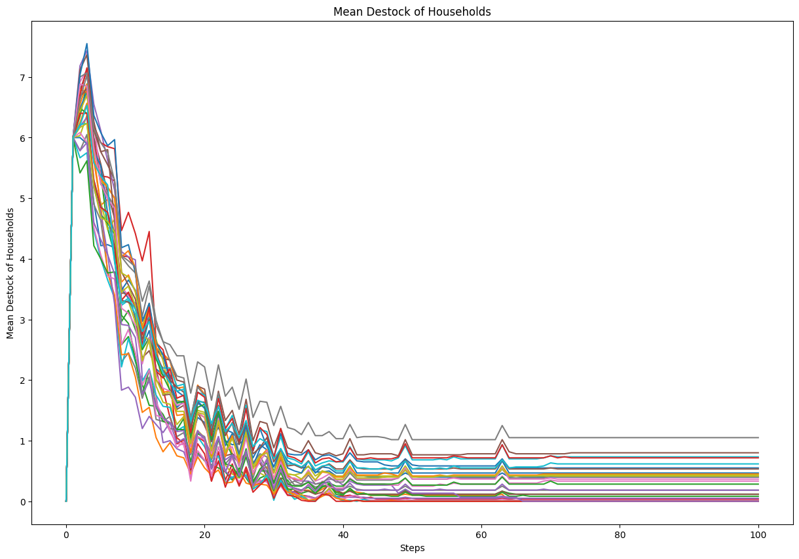

The average number of destocked livestock per household rises abruptly from 0 at the start to about 6.0 by step 1, then reaches an early maximum of roughly 6.5–7.6 around steps 2–4, indicating intense initial livestock removal as households face early resource shortfalls in the grazing system. After this peak, destocking declines quickly but unevenly: by about steps 8–12 most runs have fallen to roughly 2–4 animals, and by steps 15–25 they are generally near 0.5–2, with intermittent short-lived rebounds. From around steps 30–40 onward, destocking approaches very low levels in most runs, often near 0–0.5, showing that livestock removals become much less frequent once herd sizes and grazing pressure adjust to available pasture under the model’s household decision rules. In the later period, especially after step 50, trajectories flatten into stable low plateaus, typically between 0 and 0.8 and only occasionally near 1.0, which suggests a long-run state in which households in this common-property system experience limited but persistent livestock loss from insufficient resources rather than the severe destocking seen at the beginning.

**PLOT 7:**   
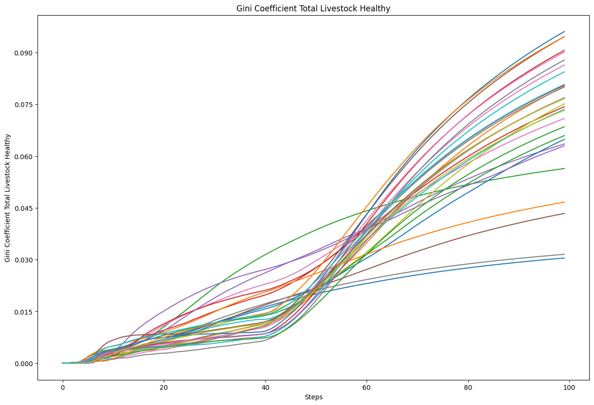

Inequality in the distribution of healthy livestock starts essentially at zero and remains very low through the early phase of the run, rising only gradually to about 0.003–0.010 by roughly step 20 and to around 0.008–0.020 by step 40 for most trajectories, indicating that households begin from a fairly even distribution of viable herds. Around steps 45–60, the coefficient increases more noticeably, with many runs moving into the 0.020–0.040 range and a few reaching about 0.045, marking the point where differences in herd outcomes begin to accumulate more strongly across households. After step 60, inequality continues to widen in nearly all runs, typically reaching about 0.045–0.075 by step 80, while one or two lower-growth trajectories remain closer to 0.028–0.040. By step 100, the outcomes span roughly 0.030 to 0.096, with most trajectories clustering around 0.060–0.090, showing that over the long term the common-property grazing system tends to produce increasing differentiation in healthy livestock holdings across households, consistent with feedbacks among rainfall variability, pasture access, herd dynamics, and behavior causing some households to maintain healthier herds than others under the E-RO setting.

**PLOT 8:**   
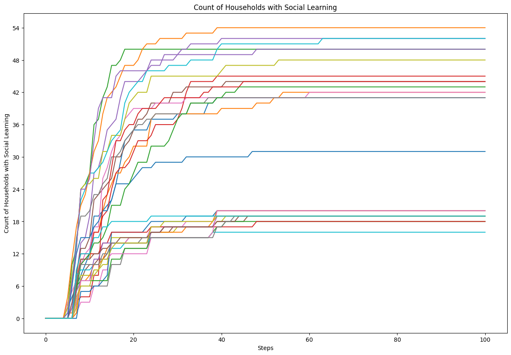

The number of households engaging in social learning starts at 0 and remains there for roughly the first 4–6 steps, then rises rapidly across all runs during the early phase of the simulation. By about steps 8–15, most runs have already reached around 10–30 households, and several climb further to about 35–45 by steps 15–25, showing a fast initial spread of social learning among the 60 households. After this early expansion, growth slows and becomes stepwise, with many runs approaching plateaus by about steps 30–50. The final levels are heterogeneous: some runs stabilize at only about 15–20 households, others around 30–45, and several reach high adoption levels of roughly 48–54 households by the end of the 100-step period. In the context of this grazing-system model, this pattern indicates that social learning tends to diffuse quickly once it appears, but its long-term reach differs across runs, implying that the behavioral change spreads broadly in some system trajectories while remaining partial in others, which would lead to different long-term feedbacks between household decision-making, livestock management, and pasture use.

**PLOT 9:**   
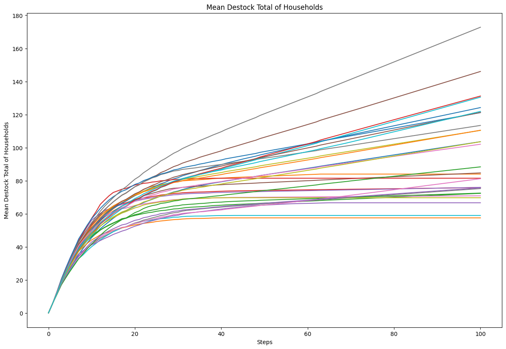

Across runs, the average cumulative number of destocked livestock starts at 0 and climbs very rapidly in the first few dozen steps, indicating substantial early livestock losses as households interact with limited grazing resources. By about step 10, most trajectories have already reached roughly 40–60 destocked animals on average across households, and by steps 15–20 they are commonly around 55–75, with a few slightly higher (near \~80). After step \~20, the rate of increase slows and trajectories begin to separate: a subset flattens early, stabilizing by roughly steps 25–35 at about \~58–70 and then changing only marginally through step 100, while others continue to accumulate destocking steadily. For the steadily increasing group, values are often around \~85–95 by steps 40–50, cross \~100 around steps 55–70, and end near \~110–130 by step 100; a smaller number rise more strongly, finishing around \~145–150, and the highest trajectory approaches \~170+ by step 100\. Interpreted in the grazing SES context (60 households, global rainfall variability enabled, and extension guidance with risk-mode active), the shared early surge reflects a system-wide initial period where stocking levels and pasture conditions trigger widespread removals, while the later divergence reflects how coupled pasture–livestock feedbacks under variable conditions can either settle into relatively stable loss levels or continue to generate recurring shortfalls that progressively destock herds over the long term.

**PLOT 10:** 

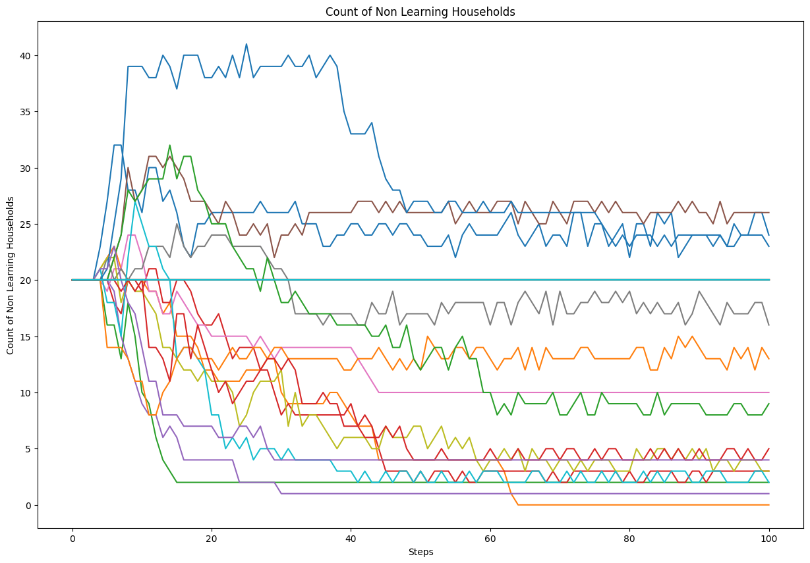

Across runs, the count of households following the non-learning E-RO strategy begins at about 20 and then diverges sharply within the first 5–15 steps, with some trajectories briefly increasing (e.g., rising to \~30–32 by steps \~8–12, and in one case peaking near \~39–41 around steps \~8–35) while many others drop quickly into the low teens or single digits. After this early adjustment, several paths settle into distinct plateaus: a persistent group remains high and stable in the mid-20s (typically \~23–27 from about steps \~20–100), another stabilizes around \~16–19, and others continue a gradual decline (for example, one trajectory falls from \~30 at \~step 12 to \~17 by \~step 35 and then to \~8–10 by \~steps 60–100). In contrast, multiple runs show near-elimination of non-learning E-RO households, dropping to \~1–3 by \~steps 30–45, with one trajectory reaching 0 around \~step 63 and staying there through the end; one run remains essentially unchanged at \~20 throughout. Interpreted in the model’s setting (fixed 60 households with extension enabled but no strategy switching via SL2), these patterns indicate that households can either retain a sizable non-learning E-RO subpopulation over the long term or shift most households away from non-learning E-RO relatively early, producing stable long-run compositions that range from near-zero up to the mid-20s.

### Long Ground Truth

“We use an agent-based model to examine long-term social-ecological consequences and implications for system resilience of such behavioral changes”; “The model captures feedback between pastures, livestock and household livelihood in a common property grazing system”; “We model a stylized common property grazing system in which households follow a certain behavioral type that specifies how they choose pastures on which they relocate, feed and breed their herds”; “We consider three household behavioral types that reflect empirically observed trends of behavioral change in different dryland regions” and “assess the social-ecological consequences of scenarios of behavioral and demographic change”; the parameters are: number-households (1.0–100.0, set to 60), satisficing-threshold (0.0–100.0, set to 0), satisficing-trials (0.0–100.0, set to 21), knowledge-radius (0.0–5.0, set to 1), resting-threshold (0.0–1.0, set to 0.1), intrinsic-preference (0.0–1.0, set to 0), social-susceptibility (0.0–1.0, set to 0), global-rain? (set to True), start-on-homepatch? (set to True), resting? (set to False), homog-behav-types? (set to True), extension-model? (set to True), SL2-strategy-switch? (set to False), risk-mode? (set to True), behavioral-type (set to E-RO), number-SAT (set to 0), number-E-RO (set to 20), number-TRAD (set to 0), b (set to 0), number-MAX (set to 0), rain-mean (set to 200), risk-att-init (set to 0.5), gr1 (set to 0.5), number-E-LBD (set to 20), gr2 (set to 0.1), number-E-RO-SL1 (set to 20), timesteps (set to 100), w (set to 0.8), number-random (set to 0), livestock-init (set to 90), and rain-std (set to 100); “Using the model, we assess the social-ecological consequences of scenarios of behavioral and demographic change” and address “Under which demographic conditions (number of pastoralist households) do differences in decision-making matter,” “When can behavioral types increase the risk for long-term negative effects such as pasture degradation and livestock loss,” and “How does behavioral change affect the resilience of the SES over the long term?”

Across the full 100 time steps, the mean household initial risk attitude remains constant within each run, with no upward or downward movement after initialization. At step 0, values are distributed across a wide range, from about \-0.11 at the low end to about 0.18 at the high end, with several runs clustered near 0, others around 0.04–0.08, and a smaller number around 0.11–0.14. These same values are preserved unchanged through step 50 and step 100, indicating that this metric functions as a fixed initial trait rather than a dynamically updated state variable. In the context of the model, this means households begin with different predispositions to deviate from the recommended livestock level, and those starting differences are carried through the simulation as stable behavioral heterogeneity while the longer-term social-ecological consequences unfold through other interacting processes.

Across the 100 steps, the average deviation from the recommended livestock level begins close to zero, with most runs between about \-0.1 and 0.15 during the first 5 steps, then rises quickly between roughly steps 5 and 20 as many trajectories move into the 0.2-0.6 range and some climb higher to about 0.7-0.8 by steps 20-35. This early increase indicates that extension agents initially shift toward stronger departures from the recommended herd size, consistent with a system in which behavioral rules and environmental feedbacks rapidly alter stocking decisions. Around steps 38-45, many trajectories show an abrupt downward adjustment, often dropping by about 0.1-0.4, and from steps 50-60 several runs decline further to near zero or into negative values, with the lowest settling around \-0.35 while others remain positive near 0.1-0.2, 0.25-0.35, 0.4-0.5, and a smaller group staying high around 0.6-0.78. From about step 60 to the end, most trajectories stabilize with only minor fluctuations, showing that the model produces a persistent spread of outcomes ranging from below-recommendation stocking to sustained above-recommendation stocking, reflecting divergent long-term behavioral responses of extension agents under the same common-property grazing conditions.

The average reserve biomass begins near 90,000 at step 0, shows a small early uptick to just above 90,000 in the first few steps, and then declines steadily through roughly steps 5–30, with most runs reaching a minimum around 80,000–85,000 and a few staying closer to 87,000–93,000. From about steps 35–45, reserve biomass turns upward, and between roughly steps 45 and 60 it increases rapidly, passing about 100,000 near step 50 and commonly reaching 115,000–123,000 by step 60\. After this recovery phase, growth slows and the trajectories level off from around steps 65–80 onward, with long-run values distributed mostly between about 111,000 and 128,000 by step 100\. In the context of the grazing system, this pattern indicates an initial period of biomass drawdown across patches, consistent with grazing pressure reducing reserves, followed by a broad recovery and stabilization of pasture biomass as feedbacks among herd behavior, patch use, and environmental conditions shift the system toward a higher-biomass state.

Across runs, mean available green biomass begins near 45,000, shows a very small early rise to roughly 45,200–45,300 in the first few steps, and then declines steadily under grazing pressure, reaching about 42,000–44,000 by steps 15–20 and a broad minimum of roughly 40,000–42,000 around steps 30–40, with a few runs remaining slightly higher near 46,000–47,000. After about step 40, the system shifts from depletion to recovery: biomass rises rapidly through steps 45–60, crossing about 50,000 near step 50 and reaching roughly 58,000–62,000 by step 60\. Beyond that point, recovery slows and the trajectories level off, ending by steps 70–100 on distinct plateaus mostly between about 55,500 and 64,000. In the context of the common-property grazing system, this pattern indicates an initial phase in which livestock use reduces forage availability across patches, followed by a strong regeneration phase in which pasture biomass rebounds and stabilizes, with the spread in final levels showing that different stochastic realizations produce somewhat different long-run pasture conditions under the same behavioral setting.

The average total livestock per household, including animals that remain in herds and those that have been destocked, begins at about 90 and falls rapidly during the first part of the simulation, dropping to roughly 75 by step 5, around 60–62 by step 10, and to about 48–50 by steps 18–20. The decline then continues more gradually, reaching a shared low point of about 40–42 around steps 33–40 across runs. After this minimum, the metric reverses and rises during the middle of the simulation, with most households recovering to about 44–47 by step 50 and to roughly 46–50 by steps 58–65. From that point onward, trajectories largely level off, but at different final values depending on the realized household dynamics: most runs stabilize between about 46 and 50, a smaller group remains lower near 41–44, and a few recover much more strongly, reaching about 59–62 by the end. In the context of the grazing system, this pattern indicates an early phase of substantial herd reduction under pressure from pasture–livestock feedbacks, followed by partial or strong rebuilding as households adjust herd management and destocking outcomes accumulate under the E-RO behavioral setting.

The average number of destocked livestock per household rises abruptly from 0 at the start to about 6.0 by step 1, then reaches an early maximum of roughly 6.5–7.6 around steps 2–4, indicating intense initial livestock removal as households face early resource shortfalls in the grazing system. After this peak, destocking declines quickly but unevenly: by about steps 8–12 most runs have fallen to roughly 2–4 animals, and by steps 15–25 they are generally near 0.5–2, with intermittent short-lived rebounds. From around steps 30–40 onward, destocking approaches very low levels in most runs, often near 0–0.5, showing that livestock removals become much less frequent once herd sizes and grazing pressure adjust to available pasture under the model’s household decision rules. In the later period, especially after step 50, trajectories flatten into stable low plateaus, typically between 0 and 0.8 and only occasionally near 1.0, which suggests a long-run state in which households in this common-property system experience limited but persistent livestock loss from insufficient resources rather than the severe destocking seen at the beginning.

Inequality in the distribution of healthy livestock starts essentially at zero and remains very low through the early phase of the run, rising only gradually to about 0.003–0.010 by roughly step 20 and to around 0.008–0.020 by step 40 for most trajectories, indicating that households begin from a fairly even distribution of viable herds. Around steps 45–60, the coefficient increases more noticeably, with many runs moving into the 0.020–0.040 range and a few reaching about 0.045, marking the point where differences in herd outcomes begin to accumulate more strongly across households. After step 60, inequality continues to widen in nearly all runs, typically reaching about 0.045–0.075 by step 80, while one or two lower-growth trajectories remain closer to 0.028–0.040. By step 100, the outcomes span roughly 0.030 to 0.096, with most trajectories clustering around 0.060–0.090, showing that over the long term the common-property grazing system tends to produce increasing differentiation in healthy livestock holdings across households, consistent with feedbacks among rainfall variability, pasture access, herd dynamics, and behavior causing some households to maintain healthier herds than others under the E-RO setting.

The number of households engaging in social learning starts at 0 and remains there for roughly the first 4–6 steps, then rises rapidly across all runs during the early phase of the simulation. By about steps 8–15, most runs have already reached around 10–30 households, and several climb further to about 35–45 by steps 15–25, showing a fast initial spread of social learning among the 60 households. After this early expansion, growth slows and becomes stepwise, with many runs approaching plateaus by about steps 30–50. The final levels are heterogeneous: some runs stabilize at only about 15–20 households, others around 30–45, and several reach high adoption levels of roughly 48–54 households by the end of the 100-step period. In the context of this grazing-system model, this pattern indicates that social learning tends to diffuse quickly once it appears, but its long-term reach differs across runs, implying that the behavioral change spreads broadly in some system trajectories while remaining partial in others, which would lead to different long-term feedbacks between household decision-making, livestock management, and pasture use.

Across runs, the average cumulative number of destocked livestock starts at 0 and climbs very rapidly in the first few dozen steps, indicating substantial early livestock losses as households interact with limited grazing resources. By about step 10, most trajectories have already reached roughly 40–60 destocked animals on average across households, and by steps 15–20 they are commonly around 55–75, with a few slightly higher (near \~80). After step \~20, the rate of increase slows and trajectories begin to separate: a subset flattens early, stabilizing by roughly steps 25–35 at about \~58–70 and then changing only marginally through step 100, while others continue to accumulate destocking steadily. For the steadily increasing group, values are often around \~85–95 by steps 40–50, cross \~100 around steps 55–70, and end near \~110–130 by step 100; a smaller number rise more strongly, finishing around \~145–150, and the highest trajectory approaches \~170+ by step 100\. Interpreted in the grazing SES context (60 households, global rainfall variability enabled, and extension guidance with risk-mode active), the shared early surge reflects a system-wide initial period where stocking levels and pasture conditions trigger widespread removals, while the later divergence reflects how coupled pasture–livestock feedbacks under variable conditions can either settle into relatively stable loss levels or continue to generate recurring shortfalls that progressively destock herds over the long term.

Across runs, the count of households following the non-learning E-RO strategy begins at about 20 and then diverges sharply within the first 5–15 steps, with some trajectories briefly increasing (e.g., rising to \~30–32 by steps \~8–12, and in one case peaking near \~39–41 around steps \~8–35) while many others drop quickly into the low teens or single digits. After this early adjustment, several paths settle into distinct plateaus: a persistent group remains high and stable in the mid-20s (typically \~23–27 from about steps \~20–100), another stabilizes around \~16–19, and others continue a gradual decline (for example, one trajectory falls from \~30 at \~step 12 to \~17 by \~step 35 and then to \~8–10 by \~steps 60–100). In contrast, multiple runs show near-elimination of non-learning E-RO households, dropping to \~1–3 by \~steps 30–45, with one trajectory reaching 0 around \~step 63 and staying there through the end; one run remains essentially unchanged at \~20 throughout. Interpreted in the model’s setting (fixed 60 households with extension enabled but no strategy switching via SL2), these patterns indicate that households can either retain a sizable non-learning E-RO subpopulation over the long term or shift most households away from non-learning E-RO relatively early, producing stable long-run compositions that range from near-zero up to the mid-20s.

### Summary Prompt

summary\_prompt: 

“””

You are given a narrative description of an Agent Based Model simulation. Your goal is to provide a summary of this description. Your output should be structured as a 3 to 4 paragraphs long summary. The first paragraph should present the context and parameters while the following paragraphs should describe key simulation trends. Here is the narrative description: “**long\_ground\_truth**”

“””

### Short Ground Truth

This agent-based model examines how behavioral change affects long-term social-ecological outcomes and resilience in a stylized common-property grazing system, where feedbacks link pastures, livestock, and household livelihoods. Households follow behavioral types that determine how they relocate and manage herds, and the simulation is used to test when demographic conditions make decision-making differences consequential, when behavioral types increase risks such as pasture degradation and livestock loss, and how behavioral change shapes long-run resilience. The model is run for 100 time steps with 60 households, behavioral type set to E-RO, extension-model and risk-mode enabled, global rainfall active, and households starting on their home patches. Key settings include satisficing-threshold \= 0, satisficing-trials \= 21, knowledge-radius \= 1, resting-threshold \= 0.1, intrinsic-preference \= 0, social-susceptibility \= 0, rain-mean \= 200, rain-std \= 100, livestock-init \= 90, risk-att-init \= 0.5, w \= 0.8, gr1 \= 0.5, gr2 \= 0.1, with 20 E-RO households, 20 E-LBD households, and 20 E-RO-SL1 households, while SAT, TRAD, MAX, and random households are set to 0\.

A central feature of the simulation is that household initial risk attitude remains fixed throughout each run, preserving the heterogeneity established at initialization rather than evolving over time. By contrast, deviation from the recommended livestock level changes quickly: it starts near zero, rises strongly in the first 20–35 steps as many runs move into substantial positive deviation, then undergoes an adjustment phase around steps 38–60, after which trajectories stabilize at very different long-run levels ranging from below-recommendation stocking to persistently high overstocking. Social learning also spreads rapidly once it appears, rising from zero after the first few steps to intermediate or high adoption in many runs, though final uptake varies widely. At the same time, the number of non-learning E-RO households diverges sharply, with some runs retaining a sizable long-run subgroup and others nearly eliminating it, indicating that the model produces multiple stable behavioral compositions under the same overall conditions.

The ecological dynamics show a shared pattern of early depletion followed by recovery. Reserve biomass begins near 90,000 and available green biomass near 45,000, both showing small initial increases before declining through roughly the first 30–40 steps under grazing pressure. After the mid-simulation turning point, both measures recover rapidly: reserve biomass commonly rises above 100,000 by around step 50 and stabilizes mostly between about 111,000 and 128,000 by the end, while green biomass rebounds to distinct plateaus mostly between about 55,500 and 64,000. This indicates that the system initially experiences pasture drawdown as herd pressure exceeds regenerative capacity, then shifts toward a higher-biomass, more stable state as feedbacks among grazing, herd behavior, and environmental variability reorganize pasture use.

Livestock outcomes mirror this sequence of stress, adjustment, and divergence. Average total livestock per household falls steeply from about 90 at the start to around 40–42 by the mid-run minimum, then partially or strongly recovers depending on the run, with most trajectories ending between about 46 and 50 and a few reaching above 60\. Destocking is extremely intense at the beginning, peaking within the first few steps, then declines rapidly and settles into very low long-run levels, showing that the major livestock losses occur early as households confront initial forage constraints. Even so, cumulative destocking keeps increasing over time and separates strongly across runs, with some trajectories stabilizing near moderate totals and others continuing upward to very high long-run losses. Meanwhile, inequality in healthy livestock distribution starts near zero but grows steadily, especially after step 45, ending at clearly higher levels in most runs. Together, these patterns indicate that under the E-RO setting the common-property grazing system tends to pass through an early phase of widespread herd stress and pasture depletion, followed by ecological recovery but increasing social differentiation, with long-run resilience depending on how behavioral change, social learning, and pasture–livestock feedbacks interact across households.

## Milk

### Source Article

[https://www.jasss.org/25/2/3.html](https://www.jasss.org/25/2/3.html)

### Context Response

The following context response was generated with GPT-5.2 Thinking using the shared context prompt reported in the Method section. The response is reproduced verbatim.

“This study aims to narrow the research gap by developing and applying an ABM of milk choice for scenarios of future UK dairy milk reduction, and a concomitant increase in plant-based alternatives”; “The model’s overall objective is to produce consumption trajectories from 2020 out to 2050 for dairy and plant-based milks (PBM)”; “The updated model is comprised of a cognitive function, where agents perceive the physical, health and environmental characteristics of milk choice, which is modified by habit and social influence,” and “agents represent consumers that each have a disposition to consider (or not) their milk consumption choices.” “At each model run, 1,000 agents are created,” so number-of-agents is set to 1000; “Memory effects are included, with agents able to store a limited amount of averaged information from a set number of previous time-steps,” so memory-lifetime is \[1,10\] and set to 5; “The number of consecutive choices that return the same majority milk type consumption needed before the effects of habit take place” means habit-threshold is \[1,10\] and set to 2; “The probability of an agent interacting” means p-interact is \[0,1\] and set to 0.3; “The initial number of consecutive choices that have returned the same majority milk type” means incumbent-initial-habit is \[0,10\] and set to 10; “The probability that an agent has the ability to perceive the impact of its choice and therefore the option of evaluating it” means social-blindness is \[0,1\] and set to 0.51; “The threshold beyond which an agent will simply justify the discrepancy between its values and behaviour” means justification is \[0,1\] and set to 0.61; “The threshold below which any discrepancy between an agent’s values and its behaviour will not trigger a state of cognitive dissonance” means cognitive-dissonance-threshold is \[0,1\] and set to 0.15; “The number of neighbours in an agent’s network” means network-parameter is \[2,10\] and set to 8; “The perception of the health impact of PBM” means alt-health-mean-initial is \[1,3\] and set to 1.69; “The perception of the environmental impact of PBM” means alt-env-mean-initial is \[1,3\] and set to 1.12; in addition, social-susceptibility is set to 0.2, habit-on? is set to True, network-type is set to “watts-strogatz,” norms is set to True, and social-conformity is set to 0.28.

### Plot Descriptions

For this ABM, the metric descriptions associated with the plot-level prompt are as follows.

plot\_descriptions: “””

1\. "The attachment is the plot representing the average weekly  
  consumption of whole milk per agent."

  2\. "The attachment is the plot representing the average weekly  
  consumption of skimmed and semi-skimmed milk per agent."

  3\. "The attachment is the plot representing the total number of times  
   agents have chosen whole milk."

  4\. "The attachment is the plot representing the total number of times  
   agents have chosen skimmed or semi-skimmed milk."

  5\. "The attachment is the plot representing the total number of milk  
  choices made by all agents combined."

  6\. "The attachment is the plot representing the mean quantity of  
  whole milk consumed by agents."

  7\. "The attachment is the plot representing the mean quantity of  
  skimmed and semi-skimmed milk consumed by agents."

  8\. "The attachment is the plot representing the mean factor applied  
  to the whole milk choice function due to habit."

  9\. "The attachment is the plot representing the mean factor applied  
  to the skimmed and semi-skimmed milk choice function due to habit."

  10\. "The attachment is the plot representing the mean percentage  
  difference between the maximum and minimum choice function scores  
  among agents."

  11\. "The attachment is the plot representing the mean deviation  
  between the agents' held health values and the implied values by  
  their milk choices."

  12\. "The attachment is the plot representing the mean deviation  
  between the agents' held environmental values and the implied values  
  by their milk choices."

“””

### Plot-Level Responses

The following plot-level descriptions were generated with GPT-5.2 Thinking using the shared trend prompt reported in the Method section. Each response is reproduced verbatim.

**PLOT 1:**   
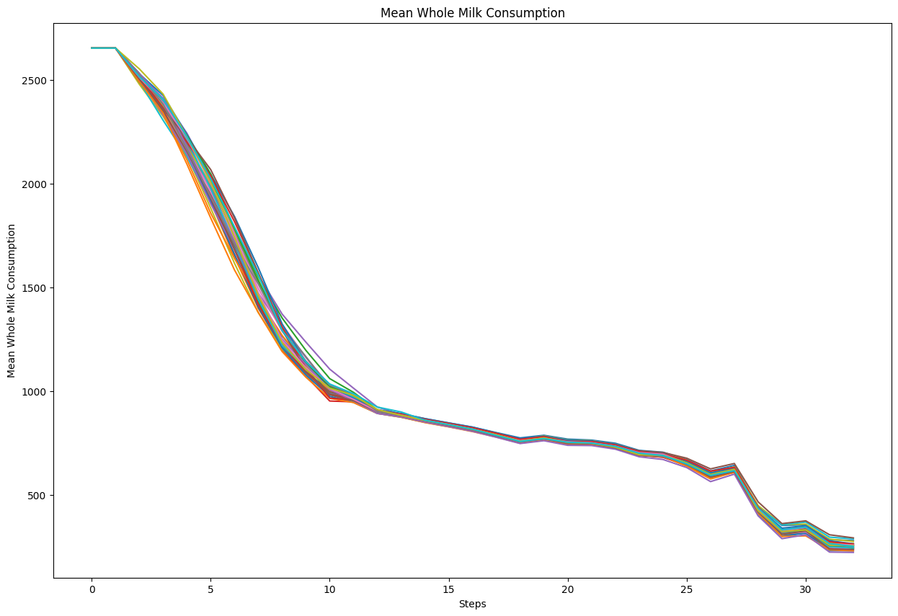

Across the repeated runs, mean weekly whole milk consumption per agent declines steadily and almost monotonically from about 2,650 at step 0 to roughly 2,400 by step 3, about 2,050 by step 5, around 1,550–1,650 by step 6, and close to 1,200–1,300 by step 8, indicating the sharpest reduction occurs early in the simulation as agents rapidly move away from initially dominant dairy consumption. The decline then continues but slows, reaching about 950–1,050 at step 10, around 900 by steps 12–13, and roughly 820–860 by steps 15–16, after which the trajectories flatten further, with values near 750–780 around steps 18–21 and about 690–720 by steps 23–24. A smaller secondary drop appears late in the run: consumption is still near 600–650 at steps 26–27, then falls more abruptly to around 400–450 at step 28 and to roughly 300–370 by steps 29–30, before ending near 240–300 at steps 31–32. The runs remain tightly clustered throughout, with only modest spread between simulations, which suggests a consistent transition in the model from entrenched habitual whole-milk consumption toward substantially lower dairy use over time under the combined effects of cognition, habit, memory, and social influence.

**PLOT 2:**   
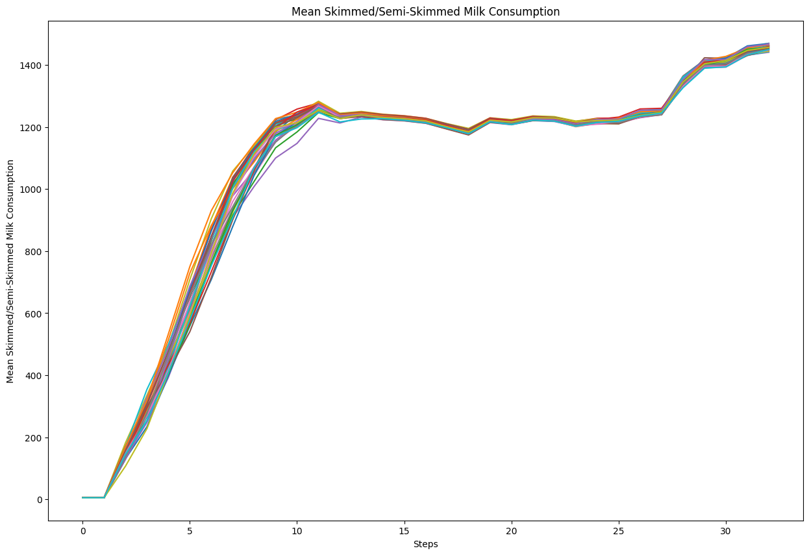

Average weekly skimmed/semi-skimmed milk consumption per agent starts near zero at steps 0–1, then climbs very rapidly over the next several steps, reaching roughly 200–250 by step 3, around 400–450 by step 4, and about 650–800 by step 5\. Growth continues but begins to slow, rising to roughly 900–1,050 by steps 6–7 and to about 1,150–1,220 by steps 8–10, before peaking around 1,260–1,290 at about step 11\. After this early peak, consumption eases slightly and settles into a long, fairly stable band near 1,200–1,240 from roughly steps 12–26, with a modest dip to around 1,180–1,200 near step 18 and small oscillations thereafter. A second regime shift occurs late in the run: values edge up to about 1,240–1,260 by steps 26–27 and then jump sharply to roughly 1,350 by step 28 and about 1,400–1,420 by steps 29–30, finishing higher at approximately 1,450–1,470 by steps 32–33. In the model’s terms, this pattern is consistent with an initial rapid move toward skimmed/semi-skimmed choices as agents evaluate options and reinforce them through social influence and habit formation, followed by a long habituated plateau (supported by short memory and repeated majority choices), and then a late acceleration indicating a renewed, population-wide shift toward these lower-fat dairy options as the simulated consumption trajectory progresses toward the later years.

**PLOT 3:**   
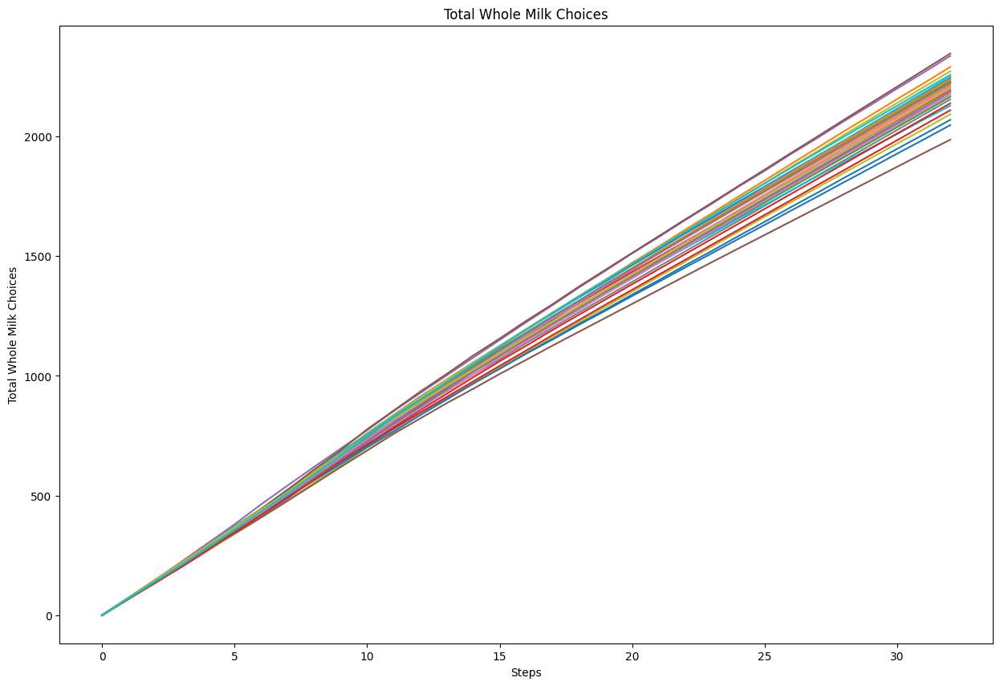

Across the 33 steps, the total number of whole milk choices increases almost perfectly linearly in every run, starting at 0 at step 0, reaching roughly 650–750 by step 10, about 1,000–1,150 by step 15, around 1,350–1,550 by step 20, and approximately 2,000–2,350 by the final step. The trajectories remain tightly clustered, with only a modest spread that becomes slightly more visible over time, indicating that repeated simulations produce very similar cumulative whole-milk selection patterns. In the context of the model, this steady upward accumulation means agents continue to select whole milk at a broadly stable rate throughout the simulated period, with variation across runs reflecting small differences in how cognition, habit, and social influence shape individual choices rather than any major shift away from whole milk over time.

**PLOT 4:**   
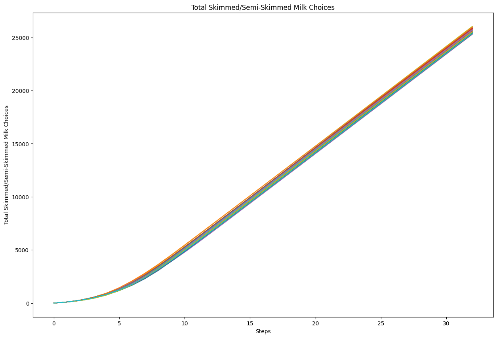

Across runs, the total number of skimmed/semi-skimmed milk choices increases monotonically from near zero at step 0, rising slowly at first and then transitioning into a near-linear accumulation. By about step 5 the total is still only on the order of \~1,000 choices, but growth accelerates through the next few steps, reaching roughly \~3,000 by steps 7–8 and around \~5,000–6,000 by step 10\. From approximately step 10 onward, the trajectories follow an almost straight-line increase with only a narrow spread between runs, climbing to about \~10,000–11,000 by step 15, \~15,000–16,000 by step 20, \~20,000–21,000 by step 25, and \~24,000–25,000 by step 30, ending near \~25,500–26,300 by steps 32–33. In the model context, this pattern is consistent with an early period in which agents’ evaluations and social interactions (with memory effects, habit activation after a short threshold, and network influence) gradually shift repeated choices toward skimmed/semi-skimmed options, after which ongoing social reinforcement and stabilized preferences/habits produce a steady, high per-step rate of selecting these milk types across the 1,000-agent population.

**PLOT 5:**   
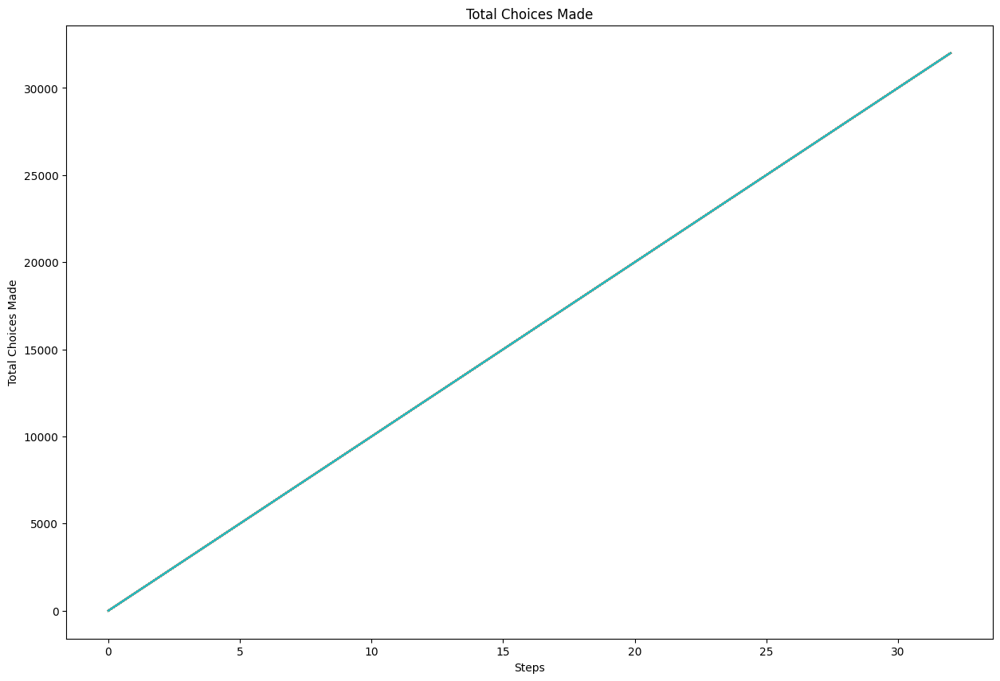

Across all simulation runs, the total number of milk choices made increases in a perfectly linear, step-by-step accumulation with no deviations between runs. It starts at 0 at step 0, reaches about 5,000 by step 5, 10,000 by step 10, 15,000 by step 15, 20,000 by step 20, 25,000 by step 25, and 30,000 by step 30, ending near 32,000 by the final step (around step 32). In the context of the model setup with 1,000 agents, this steady increase indicates that agents collectively register a fixed number of choice events each time step (roughly 1,000 additional choices per step), so this metric functions as a cumulative counter of decision opportunities over time rather than reflecting shifts in preferences driven by cognition, habit, memory, or social influence.

**PLOT 6:**   
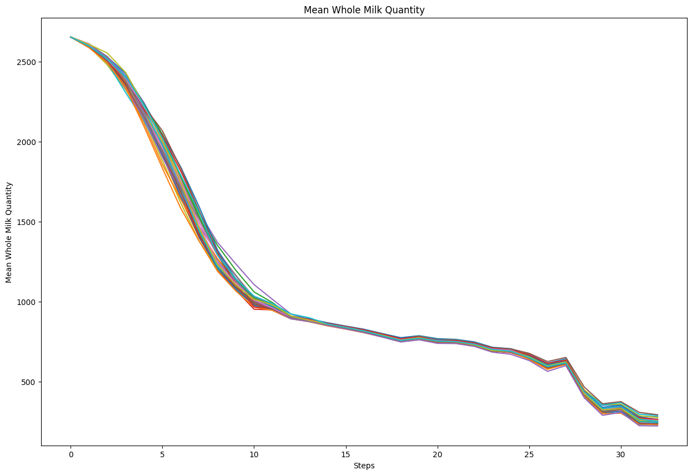

Across the repeated runs, mean whole milk consumption declines steadily and substantially over the full 32 steps, indicating a persistent shift away from whole milk in the model’s milk-choice dynamics. It begins at about 2,650 units at step 0, falls only slightly by steps 1–3 to around 2,450–2,550, then drops rapidly between roughly steps 4 and 10, reaching about 950–1,050 by step 10; this marks the main transition period in which agents’ choices move strongly away from the incumbent dairy option. After that, the decline becomes more gradual: values move from around 900 at steps 12–13 to about 820–850 by steps 15–16, then hover near 750–780 through steps 18–22 with only small fluctuations. A further reduction occurs late in the run, with consumption falling from around 680–720 at steps 23–25 to about 580–650 at step 27, then dropping sharply again around steps 28–29 to roughly 300–450, and ending near 240–300 by steps 31–32. The close clustering of runs throughout suggests a common trajectory in which habit, memory, and social influence consistently reduce average whole milk consumption over time as agents increasingly shift toward alternative milk choices.

**PLOT 7:**   
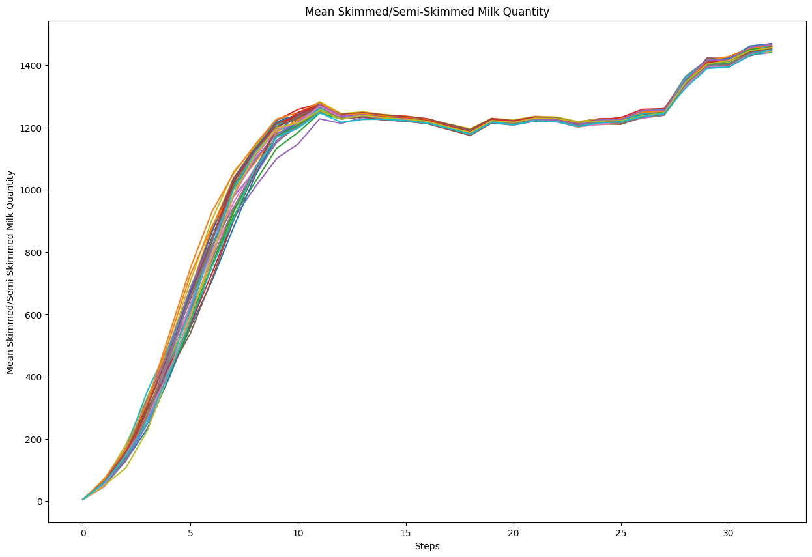

Across the repeated runs, the mean quantity of skimmed and semi-skimmed milk consumed rises very rapidly from near 0 at step 0 to roughly 230-300 by step 3, about 500-700 by step 5, around 850-1050 by step 7, and approximately 1180-1230 by step 9\. Growth then slows, reaching an early plateau near 1230-1270 around steps 10-11. From about step 12 through step 17, the mean quantity remains broadly stable with a slight easing, mostly around 1210-1245, followed by a modest dip to roughly 1185-1200 at step 18\. After this, consumption recovers gradually to around 1220-1260 by steps 21-27, before a sharper late increase begins around step 28, lifting the mean to about 1340-1370 at step 29, 1395-1420 at step 30, and roughly 1450-1470 by steps 31-32. In the context of the model, this trajectory indicates that skimmed and semi-skimmed milk becomes increasingly embedded in agents’ consumption over time, with early rapid uptake likely shaped by the interaction of cognition, social influence, and habit formation, a middle period of stabilization, and a later renewed shift toward higher consumption as these social and behavioural processes continue to accumulate across the simulated population.

**PLOT 8:**   
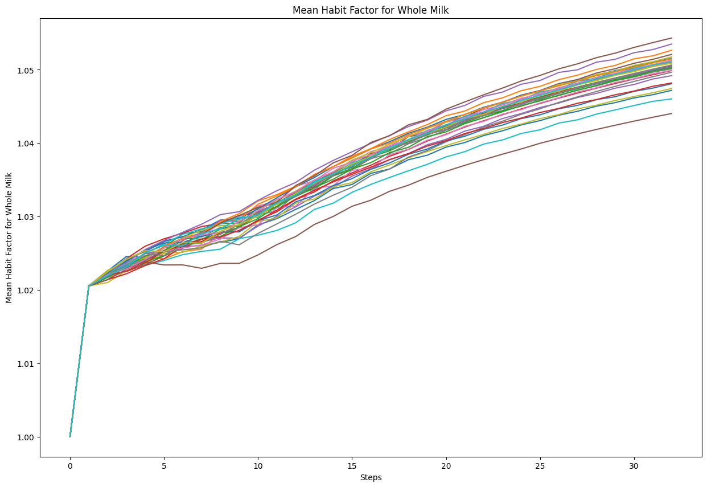

Across the 33 steps, the mean habit factor applied to whole milk choice rises gradually and almost monotonically in every run. It begins at 1.00 at step 0, jumps immediately to about 1.02 by step 1, and then continues to increase in small increments, reaching roughly 1.024–1.026 by steps 4–5 and about 1.027–1.030 by steps 8–10. The upward drift persists through the middle of the simulation, with most runs around 1.034–1.038 by steps 14–16 and about 1.040–1.043 by steps 18–20, before ending near 1.044–1.055 by the final step. Variation across runs remains modest but widens slightly over time, with one lower trajectory dipping slightly around steps 6–9 before resuming the general increase. In the context of the model, this indicates that, with habit activated and a low habit threshold, repeated whole milk choices progressively strengthen the habit-related multiplier in the whole milk choice function, so past behaviour increasingly reinforces continued selection of whole milk over the course of the simulation.

**PLOT 9:**   
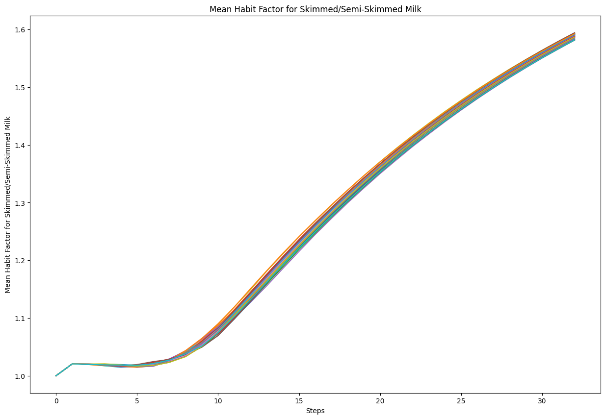

Across runs, the mean habit factor applied to the skimmed/semi-skimmed milk choice function starts essentially at baseline, at about 1.00 at step 0, rises quickly to roughly 1.02 by step 1, and then remains nearly flat with a slight dip/plateau around 1.01–1.02 through about steps 2–6. From roughly step 7 onward it increases steadily, reaching about 1.03–1.04 by steps 8–9 and around 1.08–1.09 at step 10, after which the growth accelerates through the mid-horizon (approximately 1.23–1.24 by step 15 and about 1.36–1.38 by step 20). The factor continues to climb but with gradually slowing increments later on, reaching roughly 1.46–1.48 by step 25, about 1.55–1.56 by step 30, and ending near 1.58–1.60 by steps 32–33. In the model context, this indicates that once repeated choices pass the habit-threshold (set to 2\) and are reinforced within the agents’ limited memory window (memory-lifetime set to 5), habit increasingly amplifies the propensity to select skimmed/semi-skimmed milk, producing a progressively stronger multiplicative bias in the cognitive choice process over time.

**PLOT 10:**   
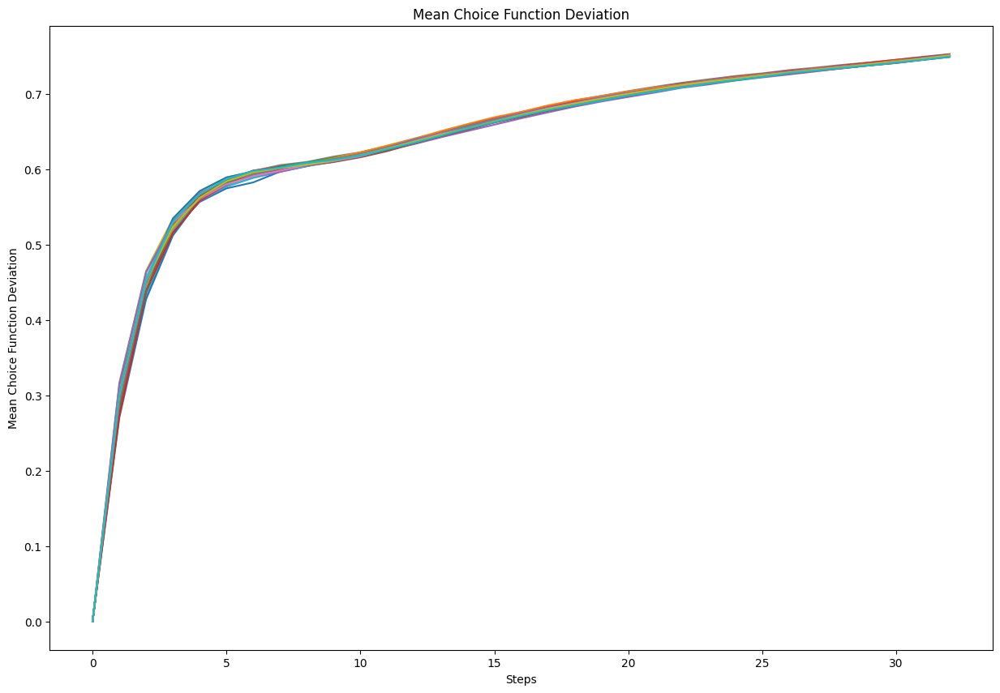

Across the 32 steps, the mean percentage difference between the maximum and minimum choice function scores among agents rises monotonically from 0 at initialization to about 0.31 by step 1, 0.45–0.47 by step 2, and just above 0.52 by step 3, indicating a very rapid early widening in the spread of agents’ choice function scores. This increase continues to around 0.56–0.57 at step 4 and about 0.58–0.59 at step 5, then slows, reaching roughly 0.60 by steps 6–7 and about 0.61–0.62 by steps 9–10. After this early acceleration, the metric grows more gradually but persistently, climbing to about 0.66 at step 14, around 0.69 at step 18, roughly 0.70–0.71 by steps 20–22, and about 0.72–0.73 by steps 25–27, before ending near 0.75 at step 32\. In the context of the model, this pattern indicates that heterogeneity in milk choice evaluations across the 1,000 agents emerges quickly and then continues to deepen more slowly over time, consistent with cognitive assessments being increasingly differentiated as memory, habit, and social influence accumulate through repeated interactions and choices.

**PLOT 11:**   
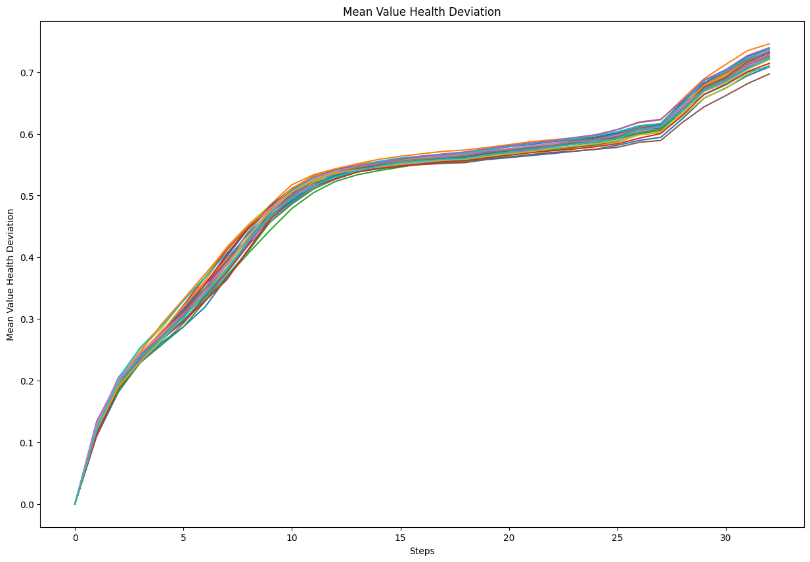

Across the 33 steps, the mean deviation between agents’ held health values and the health implications of their milk choices rises steadily in every run, starting at 0 at step 0 and increasing sharply to about 0.12–0.13 by step 1, around 0.19–0.20 by step 2, and roughly 0.24–0.25 by step 3\. The increase continues through the early and middle stages, reaching about 0.36–0.41 by step 7, around 0.47–0.49 by step 9, and approximately 0.51–0.53 by step 10, before approaching a flatter phase near 0.55–0.57 between steps 15 and 18\. From there, the metric grows only gradually to around 0.58–0.60 by steps 23–25, then shows a renewed rise after about step 27, reaching roughly 0.67–0.69 by step 30 and ending near 0.70–0.75 by step 32\. In the context of the model, this pattern indicates that agents increasingly choose milk options whose implied health characteristics diverge from the health values they hold, with early rapid growth suggesting a quick emergence of mismatch under habit, memory, and social influence, followed by a mid-run stabilization and then a later widening of the discrepancy as consumption trajectories continue to evolve.

**PLOT 12:**   
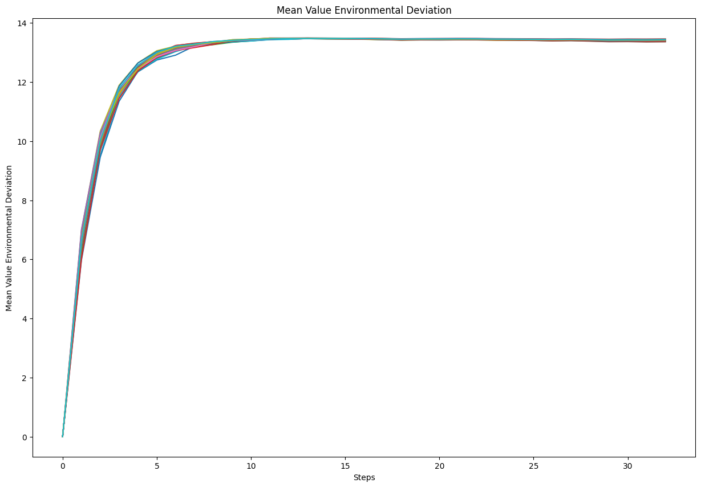

Across the repeated runs, the mean deviation between agents’ environmental values and the environmental implications of their milk choices rises very rapidly from 0 at step 0 to about 7 by step 1, around 10 by step 2, and roughly 11.5–11.9 by step 3, before continuing to increase more gradually to about 12.5–12.8 at step 4 and around 13.0–13.2 by steps 5–6. After this early adjustment, the measure approaches a clear plateau: it reaches about 13.3 by steps 7–8, around 13.4–13.45 by roughly steps 10–13, and then remains essentially flat through the rest of the simulation, with only negligible fluctuations and a slight softening to about 13.35–13.4 near the final steps. In the context of the model, this indicates that agents quickly move into a persistent state where the environmental values they hold are substantially misaligned with the environmental meaning of their milk consumption choices, after which habit, limited memory, and modest social interaction and conformity maintain that discrepancy at a stable high level rather than reducing it over time.

### Long Ground Truth

“This study aims to narrow the research gap by developing and applying an ABM of milk choice for scenarios of future UK dairy milk reduction, and a concomitant increase in plant-based alternatives”; “The model’s overall objective is to produce consumption trajectories from 2020 out to 2050 for dairy and plant-based milks (PBM)”; “The updated model is comprised of a cognitive function, where agents perceive the physical, health and environmental characteristics of milk choice, which is modified by habit and social influence,” and “agents represent consumers that each have a disposition to consider (or not) their milk consumption choices.” “At each model run, 1,000 agents are created,” so number-of-agents is set to 1000; “Memory effects are included, with agents able to store a limited amount of averaged information from a set number of previous time-steps,” so memory-lifetime is \[1,10\] and set to 5; “The number of consecutive choices that return the same majority milk type consumption needed before the effects of habit take place” means habit-threshold is \[1,10\] and set to 2; “The probability of an agent interacting” means p-interact is \[0,1\] and set to 0.3; “The initial number of consecutive choices that have returned the same majority milk type” means incumbent-initial-habit is \[0,10\] and set to 10; “The probability that an agent has the ability to perceive the impact of its choice and therefore the option of evaluating it” means social-blindness is \[0,1\] and set to 0.51; “The threshold beyond which an agent will simply justify the discrepancy between its values and behaviour” means justification is \[0,1\] and set to 0.61; “The threshold below which any discrepancy between an agent’s values and its behaviour will not trigger a state of cognitive dissonance” means cognitive-dissonance-threshold is \[0,1\] and set to 0.15; “The number of neighbours in an agent’s network” means network-parameter is \[2,10\] and set to 8; “The perception of the health impact of PBM” means alt-health-mean-initial is \[1,3\] and set to 1.69; “The perception of the environmental impact of PBM” means alt-env-mean-initial is \[1,3\] and set to 1.12; in addition, social-susceptibility is set to 0.2, habit-on? is set to True, network-type is set to “watts-strogatz,” norms is set to True, and social-conformity is set to 0.28.

Across the repeated runs, mean weekly whole milk consumption per agent declines steadily and almost monotonically from about 2,650 at step 0 to roughly 2,400 by step 3, about 2,050 by step 5, around 1,550–1,650 by step 6, and close to 1,200–1,300 by step 8, indicating the sharpest reduction occurs early in the simulation as agents rapidly move away from initially dominant dairy consumption. The decline then continues but slows, reaching about 950–1,050 at step 10, around 900 by steps 12–13, and roughly 820–860 by steps 15–16, after which the trajectories flatten further, with values near 750–780 around steps 18–21 and about 690–720 by steps 23–24. A smaller secondary drop appears late in the run: consumption is still near 600–650 at steps 26–27, then falls more abruptly to around 400–450 at step 28 and to roughly 300–370 by steps 29–30, before ending near 240–300 at steps 31–32. The runs remain tightly clustered throughout, with only modest spread between simulations, which suggests a consistent transition in the model from entrenched habitual whole-milk consumption toward substantially lower dairy use over time under the combined effects of cognition, habit, memory, and social influence.

Average weekly skimmed/semi-skimmed milk consumption per agent starts near zero at steps 0–1, then climbs very rapidly over the next several steps, reaching roughly 200–250 by step 3, around 400–450 by step 4, and about 650–800 by step 5\. Growth continues but begins to slow, rising to roughly 900–1,050 by steps 6–7 and to about 1,150–1,220 by steps 8–10, before peaking around 1,260–1,290 at about step 11\. After this early peak, consumption eases slightly and settles into a long, fairly stable band near 1,200–1,240 from roughly steps 12–26, with a modest dip to around 1,180–1,200 near step 18 and small oscillations thereafter. A second regime shift occurs late in the run: values edge up to about 1,240–1,260 by steps 26–27 and then jump sharply to roughly 1,350 by step 28 and about 1,400–1,420 by steps 29–30, finishing higher at approximately 1,450–1,470 by steps 32–33. In the model’s terms, this pattern is consistent with an initial rapid move toward skimmed/semi-skimmed choices as agents evaluate options and reinforce them through social influence and habit formation, followed by a long habituated plateau (supported by short memory and repeated majority choices), and then a late acceleration indicating a renewed, population-wide shift toward these lower-fat dairy options as the simulated consumption trajectory progresses toward the later years.

Across the 33 steps, the total number of whole milk choices increases almost perfectly linearly in every run, starting at 0 at step 0, reaching roughly 650–750 by step 10, about 1,000–1,150 by step 15, around 1,350–1,550 by step 20, and approximately 2,000–2,350 by the final step. The trajectories remain tightly clustered, with only a modest spread that becomes slightly more visible over time, indicating that repeated simulations produce very similar cumulative whole-milk selection patterns. In the context of the model, this steady upward accumulation means agents continue to select whole milk at a broadly stable rate throughout the simulated period, with variation across runs reflecting small differences in how cognition, habit, and social influence shape individual choices rather than any major shift away from whole milk over time.

Across runs, the total number of skimmed/semi-skimmed milk choices increases monotonically from near zero at step 0, rising slowly at first and then transitioning into a near-linear accumulation. By about step 5 the total is still only on the order of \~1,000 choices, but growth accelerates through the next few steps, reaching roughly \~3,000 by steps 7–8 and around \~5,000–6,000 by step 10\. From approximately step 10 onward, the trajectories follow an almost straight-line increase with only a narrow spread between runs, climbing to about \~10,000–11,000 by step 15, \~15,000–16,000 by step 20, \~20,000–21,000 by step 25, and \~24,000–25,000 by step 30, ending near \~25,500–26,300 by steps 32–33. In the model context, this pattern is consistent with an early period in which agents’ evaluations and social interactions (with memory effects, habit activation after a short threshold, and network influence) gradually shift repeated choices toward skimmed/semi-skimmed options, after which ongoing social reinforcement and stabilized preferences/habits produce a steady, high per-step rate of selecting these milk types across the 1,000-agent population.

Across all simulation runs, the total number of milk choices made increases in a perfectly linear, step-by-step accumulation with no deviations between runs. It starts at 0 at step 0, reaches about 5,000 by step 5, 10,000 by step 10, 15,000 by step 15, 20,000 by step 20, 25,000 by step 25, and 30,000 by step 30, ending near 32,000 by the final step (around step 32). In the context of the model setup with 1,000 agents, this steady increase indicates that agents collectively register a fixed number of choice events each time step (roughly 1,000 additional choices per step), so this metric functions as a cumulative counter of decision opportunities over time rather than reflecting shifts in preferences driven by cognition, habit, memory, or social influence.

Across the repeated runs, mean whole milk consumption declines steadily and substantially over the full 32 steps, indicating a persistent shift away from whole milk in the model’s milk-choice dynamics. It begins at about 2,650 units at step 0, falls only slightly by steps 1–3 to around 2,450–2,550, then drops rapidly between roughly steps 4 and 10, reaching about 950–1,050 by step 10; this marks the main transition period in which agents’ choices move strongly away from the incumbent dairy option. After that, the decline becomes more gradual: values move from around 900 at steps 12–13 to about 820–850 by steps 15–16, then hover near 750–780 through steps 18–22 with only small fluctuations. A further reduction occurs late in the run, with consumption falling from around 680–720 at steps 23–25 to about 580–650 at step 27, then dropping sharply again around steps 28–29 to roughly 300–450, and ending near 240–300 by steps 31–32. The close clustering of runs throughout suggests a common trajectory in which habit, memory, and social influence consistently reduce average whole milk consumption over time as agents increasingly shift toward alternative milk choices.

Across the repeated runs, the mean quantity of skimmed and semi-skimmed milk consumed rises very rapidly from near 0 at step 0 to roughly 230-300 by step 3, about 500-700 by step 5, around 850-1050 by step 7, and approximately 1180-1230 by step 9\. Growth then slows, reaching an early plateau near 1230-1270 around steps 10-11. From about step 12 through step 17, the mean quantity remains broadly stable with a slight easing, mostly around 1210-1245, followed by a modest dip to roughly 1185-1200 at step 18\. After this, consumption recovers gradually to around 1220-1260 by steps 21-27, before a sharper late increase begins around step 28, lifting the mean to about 1340-1370 at step 29, 1395-1420 at step 30, and roughly 1450-1470 by steps 31-32. In the context of the model, this trajectory indicates that skimmed and semi-skimmed milk becomes increasingly embedded in agents’ consumption over time, with early rapid uptake likely shaped by the interaction of cognition, social influence, and habit formation, a middle period of stabilization, and a later renewed shift toward higher consumption as these social and behavioural processes continue to accumulate across the simulated population.

Across the 33 steps, the mean habit factor applied to whole milk choice rises gradually and almost monotonically in every run. It begins at 1.00 at step 0, jumps immediately to about 1.02 by step 1, and then continues to increase in small increments, reaching roughly 1.024–1.026 by steps 4–5 and about 1.027–1.030 by steps 8–10. The upward drift persists through the middle of the simulation, with most runs around 1.034–1.038 by steps 14–16 and about 1.040–1.043 by steps 18–20, before ending near 1.044–1.055 by the final step. Variation across runs remains modest but widens slightly over time, with one lower trajectory dipping slightly around steps 6–9 before resuming the general increase. In the context of the model, this indicates that, with habit activated and a low habit threshold, repeated whole milk choices progressively strengthen the habit-related multiplier in the whole milk choice function, so past behaviour increasingly reinforces continued selection of whole milk over the course of the simulation.

Across runs, the mean habit factor applied to the skimmed/semi-skimmed milk choice function starts essentially at baseline, at about 1.00 at step 0, rises quickly to roughly 1.02 by step 1, and then remains nearly flat with a slight dip/plateau around 1.01–1.02 through about steps 2–6. From roughly step 7 onward it increases steadily, reaching about 1.03–1.04 by steps 8–9 and around 1.08–1.09 at step 10, after which the growth accelerates through the mid-horizon (approximately 1.23–1.24 by step 15 and about 1.36–1.38 by step 20). The factor continues to climb but with gradually slowing increments later on, reaching roughly 1.46–1.48 by step 25, about 1.55–1.56 by step 30, and ending near 1.58–1.60 by steps 32–33. In the model context, this indicates that once repeated choices pass the habit-threshold (set to 2\) and are reinforced within the agents’ limited memory window (memory-lifetime set to 5), habit increasingly amplifies the propensity to select skimmed/semi-skimmed milk, producing a progressively stronger multiplicative bias in the cognitive choice process over time.

Across the 32 steps, the mean percentage difference between the maximum and minimum choice function scores among agents rises monotonically from 0 at initialization to about 0.31 by step 1, 0.45–0.47 by step 2, and just above 0.52 by step 3, indicating a very rapid early widening in the spread of agents’ choice function scores. This increase continues to around 0.56–0.57 at step 4 and about 0.58–0.59 at step 5, then slows, reaching roughly 0.60 by steps 6–7 and about 0.61–0.62 by steps 9–10. After this early acceleration, the metric grows more gradually but persistently, climbing to about 0.66 at step 14, around 0.69 at step 18, roughly 0.70–0.71 by steps 20–22, and about 0.72–0.73 by steps 25–27, before ending near 0.75 at step 32\. In the context of the model, this pattern indicates that heterogeneity in milk choice evaluations across the 1,000 agents emerges quickly and then continues to deepen more slowly over time, consistent with cognitive assessments being increasingly differentiated as memory, habit, and social influence accumulate through repeated interactions and choices.

Across the 33 steps, the mean deviation between agents’ held health values and the health implications of their milk choices rises steadily in every run, starting at 0 at step 0 and increasing sharply to about 0.12–0.13 by step 1, around 0.19–0.20 by step 2, and roughly 0.24–0.25 by step 3\. The increase continues through the early and middle stages, reaching about 0.36–0.41 by step 7, around 0.47–0.49 by step 9, and approximately 0.51–0.53 by step 10, before approaching a flatter phase near 0.55–0.57 between steps 15 and 18\. From there, the metric grows only gradually to around 0.58–0.60 by steps 23–25, then shows a renewed rise after about step 27, reaching roughly 0.67–0.69 by step 30 and ending near 0.70–0.75 by step 32\. In the context of the model, this pattern indicates that agents increasingly choose milk options whose implied health characteristics diverge from the health values they hold, with early rapid growth suggesting a quick emergence of mismatch under habit, memory, and social influence, followed by a mid-run stabilization and then a later widening of the discrepancy as consumption trajectories continue to evolve.

Across the repeated runs, the mean deviation between agents’ environmental values and the environmental implications of their milk choices rises very rapidly from 0 at step 0 to about 7 by step 1, around 10 by step 2, and roughly 11.5–11.9 by step 3, before continuing to increase more gradually to about 12.5–12.8 at step 4 and around 13.0–13.2 by steps 5–6. After this early adjustment, the measure approaches a clear plateau: it reaches about 13.3 by steps 7–8, around 13.4–13.45 by roughly steps 10–13, and then remains essentially flat through the rest of the simulation, with only negligible fluctuations and a slight softening to about 13.35–13.4 near the final steps. In the context of the model, this indicates that agents quickly move into a persistent state where the environmental values they hold are substantially misaligned with the environmental meaning of their milk consumption choices, after which habit, limited memory, and modest social interaction and conformity maintain that discrepancy at a stable high level rather than reducing it over time.

### Summary Prompt

summary\_prompt: 

“””

You are given a narrative description of an Agent Based Model simulation. Your goal is to provide a summary of this description. Your output should be structured as a 3 to 4 paragraphs long summary. The first paragraph should present the context and parameters while the following paragraphs should describe key simulation trends. Here is the narrative description: “**long\_ground\_truth**”

“””

### Short Ground Truth

This study develops and applies an agent-based model of milk choice to address future UK dairy milk reduction and the rise of plant-based alternatives, with the objective of producing consumption trajectories from 2020 to 2050 for dairy and plant-based milks. The model uses a cognitive function in which agents perceive the physical, health, and environmental characteristics of milk choices, modified by habit and social influence, and each agent has a disposition to consider or not consider their milk consumption choices. Each run contains 1,000 agents, with memory-lifetime set to 5 within a range of 1 to 10, habit-threshold set to 2 within a range of 1 to 10, p-interact set to 0.3 within a range of 0 to 1, incumbent-initial-habit set to 10 within a range of 0 to 10, social-blindness set to 0.51 within a range of 0 to 1, justification set to 0.61 within a range of 0 to 1, cognitive-dissonance-threshold set to 0.15 within a range of 0 to 1, network-parameter set to 8 within a range of 2 to 10, alt-health-mean-initial set to 1.69 within a range of 1 to 3, and alt-env-mean-initial set to 1.12 within a range of 1 to 3; additionally, social-susceptibility is 0.2, habit-on? is True, network-type is watts-strogatz, norms is True, and social-conformity is 0.28.

Across repeated runs, consumption shifts strongly away from whole milk and toward skimmed and semi-skimmed milk. Mean weekly whole milk consumption per agent falls from about 2,650 at step 0 to around 950–1,050 by step 10, then declines more gradually before a late sharp drop leaves it near 240–300 by steps 31–32. In contrast, skimmed and semi-skimmed consumption rises from near zero at initialization to about 1,180–1,230 by step 9, stabilizes around 1,200–1,260 through much of the middle period, and then increases again late in the run to roughly 1,450–1,470 by the end. The cumulative choice counts reinforce this transition: total whole milk choices rise steadily but remain comparatively low, reaching roughly 2,000–2,350 by the final step, whereas total skimmed/semi-skimmed choices accelerate early and then accumulate almost linearly to around 25,500–26,300 by steps 32–33. Total milk choices overall increase in a perfectly linear manner, from 0 to about 32,000, indicating a fixed number of decision events per time step rather than changes in total opportunity to choose.

The behavioural mechanisms embedded in the model show increasingly strong reinforcement of emerging preferences. The mean habit factor for whole milk rises only slightly, from 1.00 at step 0 to about 1.044–1.055 by the end, suggesting that repeated whole milk choices continue to reinforce that option but only modestly. By contrast, the habit factor for skimmed/semi-skimmed milk grows from about 1.00 initially to around 1.58–1.60 by steps 32–33, with especially rapid growth after step 10, indicating that repeated lower-fat dairy choices increasingly amplify their own future selection once the habit threshold is crossed within the limited memory window. At the same time, the mean percentage difference between the maximum and minimum choice function scores rises from 0 at initialization to about 0.60 by steps 6–7 and approximately 0.75 by step 32, showing that heterogeneity in agents’ evaluations emerges quickly and then continues to deepen gradually as cognition, habit, and social influence accumulate.

The model also produces growing misalignment between agents’ stated values and the implications of their observed choices. The mean deviation between held health values and the health implications of milk choices increases from 0 at step 0 to about 0.51–0.53 by step 10, levels somewhat in the middle period, and then rises again to roughly 0.70–0.75 by the final steps. The environmental deviation grows even more rapidly, jumping from 0 to about 13 by steps 5–6 and then remaining on a high plateau near 13.3–13.45 for most of the run. Taken together, these trends indicate that the simulated population moves quickly away from initially dominant whole milk consumption toward skimmed and semi-skimmed options, while habit formation, short memory, and modest social interaction stabilize and reinforce those new patterns; however, this transition is accompanied by persistent and, in the health dimension, increasing discrepancies between the values agents hold and the implications of the choices they make.

