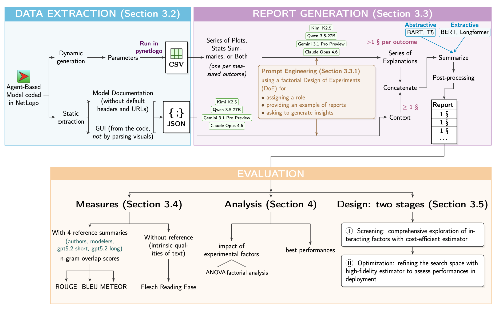

# distill-abm documentation

`distill-abm` is an executable ABM-to-LLM research pipeline. It converts model documentation, parameters, and simulation data into plots, statistical evidence, textual explanations, optional summaries, and reference-based evaluations.

This site is the authoritative public documentation. The root [README](https://github.com/NoeFlandre/distill-abm/blob/main/README.md) remains a short project landing page; this site contains the operational detail.

## Start here

- **New to the project:** [Getting started](getting-started.md)
- **Understanding the system:** [Pipeline and architecture](ARCHITECTURE.md)
- **Running commands:** [CLI reference](cli-reference.md)
- **Checking defaults and model policy:** [Configuration](CONFIG_REFERENCE.md)
- **Finding or synchronizing outputs:** [Results and synchronization](RESULTS_BUCKET.md)
- **Contributing:** [Development and verification](development.md)
- **Citing the work:** [Citation](citation.md)

## Pipeline at a glance

1. Ingest ABM parameters, documentation, and simulation data.
2. Generate plots and, when requested, statistical table evidence.
3. Generate context and trend text with a configured language-model adapter.
4. Optionally summarize the trend text with a local summarizer backend.
5. Score selected and full-text outputs against configured references.
6. Persist reports, metadata, traces, and review artifacts.

The pipeline has two important boundaries:

- **GitHub:** source code, configuration, tests, and documentation.
- **Hugging Face:** generated results in the [`distill-abms-results` bucket](https://huggingface.co/buckets/NoeFlandre/distill-abms-results).

Provider-backed inference and NetLogo execution are opt-in. Start with the non-LLM validation command in [Getting started](getting-started.md) before running an expensive workflow.

## Project scope

The configured paper-facing ABMs are `fauna`, `milk_consumption`, and `grazing`. The registry also contains development and debug models; the CLI applies model-policy checks so debug models are not silently treated as benchmark runs.

## Maintained reference pages

- [`ARCHITECTURE.md`](ARCHITECTURE.md) — data flow, module boundaries, and artifact lifecycle.
- [`CONFIG_REFERENCE.md`](CONFIG_REFERENCE.md) — YAML configuration and runtime defaults.
- [`RESULTS_BUCKET.md`](RESULTS_BUCKET.md) — results layout and safe synchronization.
